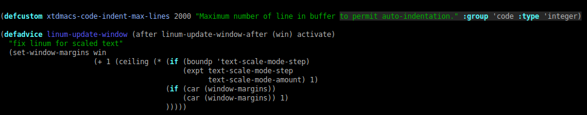

Xtdmacs provides a bunch a development tools and ready-to-use configuration.

Install
=======


```bash
wget https://github.com/psycofdj/xtdmacs/archive/0.0.1.tar.gz -O xtdmacs-0.0.1.tar.gz
tar xvzf xtdmacs-0.0.1.tar.gz
cd xtdmacs-0.0.1
make install
```

Features
========

xtdmacs-bindings
----------------

This optional mode setup keyboard bindings for the most commonly used
features.

It also configures iswitchb module to ignore standard system buffers like
\*Help\* \*scratch\* \*Messages\* etc..

### Install

##### manually

```
M-x xtdmacs-bindings-mode
```

##### from ~/.emacs:
```
(xtdmacs-bindings-mode)
```

##### using emacs customizaton:

```M-x customize-variable RET xtdmacs-bindings-mode```

-> change value to on, then apply and save

### Bindings

| Key                           | Effect                                | Key                           | Effect                                |
|-------------------------------|---------------------------------------|-------------------------------|---------------------------------------|
| \<home\>                      | move cursor to end of line            | \<ctrl\>+x \<ctrl\>+\<right\> | display next buffer                   |
| \<select\>                    | move cursor to end of line            | \<ctrl\>+x \<ctrl\>+\<left\>  | display previous buffer               |
| \<alt\>+\<up\>                | move cursor to beggining of buffer    | \<ctrl\>+x \<ctrl\>+\<down\>  | prompt buffer to display              |
| \<alt\>+\<down\>              | move curtor to end of buffer          | \<ctrl\>+x k                  | close current buffer                  |
| \<ctrl\>+\<right\>            | move cursor to end of word            | \<ctrl\>+x \<ctrl\>+f         | open file                             |
| \<ctrl\>+\<left\>             | move cursor to beginning of word      | \<alt\>+\<plus\>              | enlarge current window's height       |
| \<ctrl\>+c \<ctrl\>+g         | goto given line                       | \<alt\>+\<minus\>             | shink current window's height         |
| \<ctrl\>+d                    | search and replace                    | \<alt\>+\<delete\>            | delete previous word                  |
| \<ctrl\>+f                    | search and replace regexp             | \<alt\>+s                     | display speedbar                      |
| \<alt\>+d                     | align regexp                          | \<alt\>+/                     | autocomplete current word             |
| \<ctrl\>+x \<right\>          | move cursor to the right window       | \<ctrl\>+l                    | insert current date                   |
| \<ctrl\>+x \<left\>           | move cursor to the left window        | \<alt\>+q                     | comment region                        |
| \<ctrl\>+x \<up\>             | move cursor to the top window         | \<alt\>+a                     | uncomment region                      |
| \<ctrl\>+x \<down\>           | move cursor to the bottom window      | \<F5\>                        | delete buffer's trailing whitespaces  |
| \<ctrl\>+\<F5\>               | refresh buffer syntax colors          | \<ctrl\>+\<F11\>              | toggle terminal shell                 |
| \<F11\>                       | display menu                          |                               |                                       |


xtdmacs-loader
--------------

This package helps customizing which minors modes should be loaded for each
file extensions.

In order modify associations between file extensions are minor modes, the simpler
is to customize the *xtdmacs-loader-auto-minor-mode-alist* variable.


xtdmacs-code-mode
-----------------

This minor mode enabled multi-language tools that help editing code.

### highlight+80+-mode

Colorize lines that are longer than a specific number of columns (default 80).


To set the number of columns :
```
M-x customize-variable RET highlight-80+-columns RET
```

You can also customize the face used to display long lines :
```
M-x customize-face RET highlight-80+ RET
M-x customize-face RET highlight-80+-first RET
M-x customize-face RET highlight-80+-line RET
```

### linum-mode

Display current line number and fix default window margin


To customize columns number face :
```
M-x customize-face RET linum RET
```

### xtdmacs-code-spell-mode

See dedicated section

### xtdmacs-compile++-mode

See dedicated section

### Aligning variables and parameters

xtdmacs-code-mode provides two utility functions : *xtdmacs-code-align-vars* and
*xtdmacs-code-align-args* that format a specific region to a **matrix readable** form.

```c++
// given this code snipset :
// mark
void myfunction(const std::string& p_parameter1,
                int p_param2,
                std::vector<std::string>& p_result);
// cursor

// xtdmacs-code-align-args between mark and cursor will produce :
void myfunction(const std::string&        p_parameter1,
                int                       p_param2,
                std::vector<std::string>& p_result);


// given this code snipset :
// mark
  std::cout << "my current process" << l_tmp
            << "is about to fail because of " << l_reason
            << std::endl;
// cursor

// xtdmacs-code-align-args between mark and cursor will produce :
  std::cout << "my current process"           << l_tmp
            << "is about to fail because of " << l_reason
            << std::endl;


// given this code snipset :
void foo(void)
{
// mark
  int l_var1 = 0;
  string l_name = "bar";
  const vector<string> l_contacts = { "foo", "bar" };
// cursor
}


// xtdmacs-code-align-vars between mark and cursor will produce :
void foo(void)
{
  int                  l_var1     = 0;
  string               l_name     = "bar";
  const vector<string> l_contacts = { "foo", "bar" };
}
```

### Bindings


| Key                           | Effect                                         |
|-------------------------------|------------------------------------------------|
| \<ctrl\>+\<alt\>+\<up\>       | move cursor to beginning of current expression |
| \<ctrl\>+\<alt\>+\<down\>     | move cursor to end of current expression       |
| \<alt\>+q                     | comment region                                 |
| \<alt\>+a                     | uncomment region                               |
| \<F4\>                        | indent region                                  |
| \<ctrl\>+\<F4\>               | indent buffer                                  |
| \<ctrl\>+\<F1\>               | align variables between mark and cursor        |
| \<ctrl\>+\<F2\>               | align parameters between mark and cursor       |


xtdmacs-compile++
-----------------

This minor mode wraps the default compilation mode in order to profide a set of
pre-defined compilation commands. It also allows to use function instead of
plain string as default compile commands.

There is 3 predefined commands : **compile**, **test** and **deploy**

#### Behind the curtain

The whole thing is configurable through customizing **xtdmacs-compile++-config-alist**
```
M-x customize-variable RET xtdmacs-compile++-config-alist RET
```

Where **xtdmacs-compile++-config-alist** is an alist of the form
```lisp
(("command1" . config-alist)
 ("command2" . config-alist))
```

and where each *config-alist* is an alist of the form
```lisp
(("get-params" . function)
 ("command"    . string-or-function))
```

The *get-params* function is called interactivaly to prompt for specific parameters
of the command. Ex. for c++ "compile" command, we prompt for working directory,
optional environment variables and specific script to run.

The *command* item build the final command send to default compilation-mode. Ex. for
c++ it will construct something like ```cd dir && key=value make -j``` from values
prompted by *get-params*.

Usually, *get-params* uses *xtdmacs-compile++-config-alist* itself to store the values
prompted to user user. Ex :
```lisp
(("compile" .
     (("dir"        . "~/build")
      ("env"        . "VE=1")
      ("bin"        . "make -j 12")
      ("get-params" . (lambda() (xtdmacs-compile++-default-params  "compile")))
      ("command"    . (lambda() (xtdmacs-compile++-default-command "compile"))))))
```

#### Other
arrange window


#### Configuration

**xtdmacs-compile++-mode** provide utility functions that helps building your own
*get-param* and *command* function values.

* ```xtdmacs-compile++-get-nearest-filename (name)``` returns the closest path parent
  to current buffer file that contains a file or a directory named *name*
* ```xtdmacs-compile++-get-dir-locals-directory``` returns the path containing
  the nearest .dir-locals.el configuration file (nil if none)
* ```xtdmacs-compile++-get-dir-git``` return the closest parent from buffer containing
  a *.git* directory, often used as project root directory.
* ```xtdmacs-compile++-guess-directory``` returns the build directory assuming your
  are using automake's VPATH builds in a directory named .release in your project root


* xtdmacs-compile++-docker-params
* xtdmacs-compile++-docker-run-command
* xtdmacs-compile++-docker-exec-command
* xtdmacs-compile++-default-params

xtdmacs-compile++-buffer-height
xtdmacs-compile++-scroll-output
xtdmacs-compile++-buffer-local

Interactively :
```
M-x customize-variable RET xtdmacs-compile++-config-alist RET
```

For a specific directory :

```lisp
cat ~/.dir-locals.el
("dev/myproject/"
  . ((nil
    . ((xtdmacs-compile++-config-alist
       . (("compile"
          . (("dir"        . xtdmacs-compile++-get-dir-git)
             ("get-params" . (lambda() (xtdmacs-compile++-docker-params "compile")))
             ("command"    . (lambda() (xtdmacs-compile++-docker-run-command "compile")))
             ("env"        . "")
             ("bin"        . "make -j 12")
             ("service"    . "ws-compile")))
          ("test"
          . (("dir"        . xtdmacs-compile++-get-dir-git)
             ("get-params" . (lambda() (xtdmacs-compile++-docker-params "test")))
             ("command"    . (lambda() (xtdmacs-compile++-docker-run-command "test" "exec")))
             ("env"        . "")
             ("bin" . "bash -c 'cd /build && make test'")
             ("service"    . "ws-rt")))
          ("deploy"
          . (("dir"        . xtdmacs-compile++-get-dir-git)
             ("get-params" . (lambda() (xtdmacs-compile++-docker-params "deploy")))
             ("command"    . (lambda() (xtdmacs-compile++-docker-run-command "deploy" "exec")))
             ("env"        . "")
             ("bin" . "bash -c 'cd /build && sudo -E make install_all'")
             ("service"    . "ws-rt")))))))))
```


### Bindings


| Key                           | Effect                                         |
|-------------------------------|------------------------------------------------|
| \<F6\>                        | run *compile* command                          |
| \<F7\>                        | run *test* command                             |
| \<F8\>                        | run *deploy* command                           |
| \<ctrl\>+\<F6\>               | prompt before running *compile* command        |
| \<ctrl\>+\<F7\>               | prompt before running *test* command           |
| \<ctrl\>+\<F8\>               | prompt before running *deploy* command         |
| \<ctrl\>+\<alt\>+\<F6\>       | run *doc* command                              |
| \<alt\>+\<F6\>                | kill sunning process                           |
| \<alt\>+\<F7\>                | kill sunning process                           |
| \<alt\>+\<F8\>                | kill sunning process                           |
| \<F9>                         | goto next compile error                        |
| \<ctrl\>+\<F9>                | goto next compile error or warning             |
