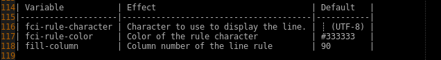
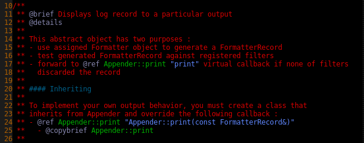

<!-- markdown-toc start - Don't edit this section. Run M-x markdown-toc-generate-toc again -->
**Table of Contents**

- [Install](#install)
- [General purpose modes](#general-purpose-modes)
    - [xtdmacs-bindings](#xtdmacs-bindings)
        - [Load](#load)
            - [Manually](#manually)
            - [From ~/.emacs:](#from-emacs)
            - [Using emacs customization](#using-emacs-customization)
        - [ido-mode and swbuff](#ido-mode-and-swbuff)
            - [Bindings](#bindings)
        - [Other bindings](#other-bindings)
    - [xtdmacs-loader](#xtdmacs-loader)
    - [xtdmacs-code-mode](#xtdmacs-code-mode)
        - [fill-column-indicator](#fill-column-indicator)
        - [linum-mode](#linum-mode)
        - [Aligning variables and parameters](#aligning-variables-and-parameters)
        - [Bindings](#bindings)
    - [xtdmacs-compile++-mode](#xtdmacs-compile-mode)
        - [Window managment](#window-managment)
        - [Behind the curtain](#behind-the-curtain)
        - [API](#api)
        - [Configuration](#configuration)
        - [Bindings](#bindings)
    - [xtdmacs-code-doxygen-mode](#xtdmacs-code-doxygen-mode)
    - [xtdmacs-code-line-mode](#xtdmacs-code-line-mode)
    - [xtdmacs-code-spell-mode](#xtdmacs-code-spell-mode)
- [Language specific modes](#language-specific-modes)
    - [xtdmacs-code-cpp-mode](#xtdmacs-code-cpp-mode)
    - [xtdmacs-code-java-mode](#xtdmacs-code-java-mode)
    - [xtdmacs-code-js-mode](#xtdmacs-code-js-mode)
    - [xtdmacs-code-json-mode](#xtdmacs-code-json-mode)
    - [xtdmacs-code-lisp-mode](#xtdmacs-code-lisp-mode)
    - [xtdmacs-code-makefile-mode](#xtdmacs-code-makefile-mode)
    - [xtdmacs-code-python-mode](#xtdmacs-code-python-mode)
    - [xtdmacs-code-php-mode](#xtdmacs-code-php-mode)
    - [xtdmacs-code-web-mode](#xtdmacs-code-web-mode)

<!-- markdown-toc end -->

Xtdmacs provides a bunch a development tools and ready-to-use configuration.

---

# Install

 ```bash
 wget https://github.com/psycofdj/xtdmacs/archive/0.0.1.tar.gz -O xtdmacs-0.0.1.tar.gz
 tar xvzf xtdmacs-0.0.1.tar.gz
 cd xtdmacs-0.0.1
 make install
 ```


# General purpose modes

## xtdmacs-bindings

This optional mode setup keyboard bindings for the most commonly used
features.

### Load

#### Manually

```
M-x xtdmacs-bindings-mode
```

#### From ~/.emacs:
```
(xtdmacs-bindings-mode)
```

#### Using emacs customization

```M-x customize-variable RET xtdmacs-bindings-mode```

-> change value to on, then apply and save

### ido-mode and swbuff

The ido (Interactively do things) mode provides an efficient way to navigate among
openned buffers. Ido display available buffer names in minibuffer and filters the
list as you type characters.

swbuffer defines functions to directly cycle among existing buffers. It also
provides a way to ignore a list of buffer names in this cycle. Typically,
users will ignore systems buffers like ```*Help*``` or ```*Message*```.

To customize list of ignore buffers :

```M-x customize-variable RET swbuff-exclude-buffer-regexps```

ido completion will also ignore patterns defined in
```swbuff-exclude-buffer-regexps``` but will suggest them if typed characters
matches nothing but filtered buffer names.


Example:


#### Bindings

| Key                           | Effect                                |
|-------------------------------|---------------------------------------|
| \<ctrl\>+x \<ctrl\>+\<down\>  | Run ido interactive buffer selection  |
| \<left\>                      | (in ido) next buffer suggestion       |
| \<left\>                      | (in ido) previous buffer suggestion   |
| RET                           | (in ido) display selected buffer      |
| \<ctrl\>+x \<ctrl\>+\<right\> | display next buffer                   |
| \<ctrl\>+x \<ctrl\>+\<left\>  | display previous buffer               |


### Other bindings

| Key                           | Effect                                | Key                           | Effect                                |
|-------------------------------|---------------------------------------|-------------------------------|---------------------------------------|
| \<home\>                      | move cursor to end of line            | \<ctrl\>+x \<ctrl\>+f         | open file                             |
| \<select\>                    | move cursor to end of line            | \<alt\>+\<plus\>              | enlarge current window's height       |
| \<alt\>+\<up\>                | move cursor to beginning of buffer    | \<alt\>+\<minus\>             | shrink current window's height        |
| \<alt\>+\<down\>              | move cursor to end of buffer          | \<alt\>+\<delete\>            | delete previous word                  |
| \<ctrl\>+\<right\>            | move cursor to end of word            | \<alt\>+s                     | display speedbar                      |
| \<ctrl\>+\<left\>             | move cursor to beginning of word      | \<alt\>+/                     | autocomplete current word             |
| \<ctrl\>+c \<ctrl\>+g         | goto given line                       | \<ctrl\>+l                    | insert current date                   |
| \<ctrl\>+d                    | search and replace                    | \<alt\>+q                     | comment region                        |
| \<ctrl\>+f                    | search and replace regexp             | \<alt\>+a                     | uncomment region                      |
| \<alt\>+d                     | align regexp                          | \<F5\>                        | delete buffer's trailing whitespaces  |
| \<ctrl\>+x \<right\>          | move cursor to the right window       | \<ctrl\>+\<F11\>              | toggle terminal shell                 |
| \<ctrl\>+x \<left\>           | move cursor to the left window        |                               |                                       |
| \<ctrl\>+x \<up\>             | move cursor to the top window         |                               |                                       |
| \<ctrl\>+x \<down\>           | move cursor to the bottom window      |                               |                                       |
| \<ctrl\>+\<F5\>               | refresh buffer syntax colors          |                               |                                       |
| \<F11\>                       | display menu                          |                               |                                       |


## xtdmacs-loader

This package helps customizing which minors modes should be loaded for each
file extensions.

In order modify associations between file extensions are minor modes, the simpler
is to customize the *xtdmacs-loader-auto-minor-mode-alist* variable.


## xtdmacs-code-mode

This minor mode enabled multi-language tools that help editing code.

### fill-column-indicator

Displays a vertical line at the specified column number, discouraging (but not
preventing) the developper to make too long lines.

The following variables custimize the behaviour of this minor mode :

| Variable           | Effect                                | Default   |
|--------------------|---------------------------------------|-----------|
| fci-rule-character | Character to use to display the line. | ┊ (UTF-8) |
| fci-rule-color     | Color of the rule character           | #333333   |
| fill-column        | Column number of the line rule        | 90        |


Example : (vertical line on extreme right)




### linum-mode

Display current line number and fix default window margin


To customize columns number face :
```
M-x customize-face RET linum RET
```

### Aligning variables and parameters

xtdmacs-code-mode provides two utility functions : *xtdmacs-code-align-vars* and
*xtdmacs-code-align-args* that format a specific region to a **matrix readable** form.

```c++
// given this code snippet :
// mark
void myfunction(const std::string& p_parameter1,
                int p_param2,
                std::vector<std::string>& p_result);
// cursor

// xtdmacs-code-align-args between mark and cursor will produce :
void myfunction(const std::string&        p_parameter1,
                int                       p_param2,
                std::vector<std::string>& p_result);


// given this code snippet :
// mark
  std::cout << "my current process" << l_tmp
            << "is about to fail because of " << l_reason
            << std::endl;
// cursor

// xtdmacs-code-align-args between mark and cursor will produce :
  std::cout << "my current process"           << l_tmp
            << "is about to fail because of " << l_reason
            << std::endl;


// given this code snippet :
void foo(void)
{
// mark
  int l_var1 = 0;
  string l_name = "bar";
  const vector<string> l_contacts = { "foo", "bar" };
// cursor
}


// xtdmacs-code-align-vars between mark and cursor will produce :
void foo(void)
{
  int                  l_var1     = 0;
  string               l_name     = "bar";
  const vector<string> l_contacts = { "foo", "bar" };
}
```

### Bindings


| Key                           | Effect                                         |
|-------------------------------|------------------------------------------------|
| \<ctrl\>+\<alt\>+\<up\>       | move cursor to beginning of current expression |
| \<ctrl\>+\<alt\>+\<down\>     | move cursor to end of current expression       |
| \<alt\>+q                     | comment region                                 |
| \<alt\>+a                     | uncomment region                               |
| \<F4\>                        | indent region                                  |
| \<ctrl\>+\<F4\>               | indent buffer                                  |
| \<ctrl\>+\<F1\>               | align variables between mark and cursor        |
| \<ctrl\>+\<F2\>               | align parameters between mark and cursor       |


## xtdmacs-compile++-mode

This minor mode wraps the default compilation mode in order to provide a set of
pre-defined compilation commands. It also allows to use function instead of
plain string as default compile commands.

There is 3 predefined commands : **compile**, **test** and **deploy**

### Window managment

xtdmacs-compile++ dedicates a window to the compilation buffer's preventing
emacs to use it to open new files. It also sets this window's height according
to ```xtdmacs-compile++-buffer-height``` variable and enables optionally
automatic scrolling if ```xtdmacs-compile++-scroll-output``` is non nil.


### Behind the curtain

The predefinied commands are defined in the **xtdmacs-compile++-config-alist**
variable.

Where **xtdmacs-compile++-config-alist** is an alist of the form
```lisp
(("command1" . config-alist)
 ("command2" . config-alist))
```

and where each *config-alist* is an alist of the form
```lisp
(("get-params" . function)
 ("command"    . string-or-function))
```

The **get-params** function is called interactively to prompt for specific parameters
of the command. Ex. for c++ "compile" command, we prompt for working directory,
optional environment variables and specific script to run.

The **command** item build the final command send to default compilation-mode. Ex. for
c++ it will construct something like ```cd dir && key=value make -j``` from values
prompted by **get-params**.

Usually, **get-params** uses *xtdmacs-compile++-config-alist* itself to store the values
prompted to user user. Ex :
```lisp
(("compile" .
     (("dir"        . "~/build")
      ("env"        . "VE=1")
      ("bin"        . "make -j 12")
      ("get-params" . (lambda() (xtdmacs-compile++-default-params  "compile")))
      ("command"    . (lambda() (xtdmacs-compile++-default-command "compile"))))))
```

### API

**xtdmacs-compile++-mode** provide utility functions that helps building your own
**get-param** and **command** function values.

* **```xtdmacs-compile++-get-nearest-filename (name)```** returns the closest path parent
  to current buffer file that contains a file or a directory named *name*

* **```xtdmacs-compile++-get-dir-locals-directory```** returns the path containing
  the nearest .dir-locals.el configuration file (nil if none)

* **```xtdmacs-compile++-get-dir-git```** return the closest parent from buffer containing
  a *.git* directory, often used as project root directory.

* **```xtdmacs-compile++-guess-directory```** returns the build directory assuming your
  are using automake's VPATH builds in a directory named .release in your project root


In addition the mode provides some usable default function :

* **```xtdmacs-compile++-default-params```**: this function prompt interactively
  for :
  * a build directory, default given by ```"dir"``` function/value
  * some environment variables, default given by ```"env"``` function/value
  * a build command, , default given by ```"bin"``` function/value

* **```xtdmacs-compile++-default-command```** : build the command as
  * ```cd <bin> && <env> <bin>```

* **```xtdmacs-compile++-docker-params```** : like ```xtdmacs-compile++-default-params```
  but also prompts for :
  * a docker-compose service name, default given by ```"service"``` function/value
  * a docker-compose file path, default given by ```"compose-file"``` function/value

* **```xtdmacs-compile++-docker-run-command```** : build the command as
  * ```cd <dir> && docker-compose -f <compose-file> run [-e <env:key>=<env:val>] <service> <bin>```

* **```xtdmacs-compile++-docker-exec-command```** : same as ```xtdmacs-compile++-docker-run-command```
  but with exec sub command (>= docker v1.11)

### Configuration

Define the number of lines displayed in compilation buffer :
* ```M-x customize-variable RET xtdmacs-compile++-buffer-height RET```

Enables automatic scrolling of compilation buffer :
* ```M-x customize-variable RET xtdmacs-compile++-scroll-output RET```

Set commands configuration interactively :
* ```M-x customize-variable RET xtdmacs-compile++-buffer-local RET```

Customize mode-line face when compile process is running :
* ```M-x customize-face RET xtdmacs-compile++-compiling-face RET```

Customize mode-line face when compile exited with error :
* ```M-x customize-face RET xtdmacs-compile++-error-face RET```


Set commands for a specific project :
```lisp
cat ~/.dir-locals.el
("dev/myproject/"
  . ((nil
    . ((xtdmacs-compile++-config-alist
       . (("compile"
          . (("dir"        . xtdmacs-compile++-get-dir-git)
             ("get-params" . (lambda() (xtdmacs-compile++-docker-params "compile")))
             ("command"    . (lambda() (xtdmacs-compile++-docker-run-command "compile")))
             ("env"        . "")
             ("bin"        . "make -j 12")
             ("service"    . "ws-compile")))
          ("test"
          . (("dir"        . xtdmacs-compile++-get-dir-git)
             ("get-params" . (lambda() (xtdmacs-compile++-docker-params "test")))
             ("command"    . (lambda() (xtdmacs-compile++-docker-run-command "test" "exec")))
             ("env"        . "")
             ("bin" . "bash -c 'cd /build && make test'")
             ("service"    . "ws-rt")))
          ("deploy"
          . (("dir"        . xtdmacs-compile++-get-dir-git)
             ("get-params" . (lambda() (xtdmacs-compile++-docker-params "deploy")))
             ("command"    . (lambda() (xtdmacs-compile++-docker-run-command "deploy" "exec")))
             ("env"        . "")
             ("bin" . "bash -c 'cd /build && sudo -E make install_all'")
             ("service"    . "ws-rt")))))))))
```


### Bindings


| Key                           | Effect                                         |
|-------------------------------|------------------------------------------------|
| \<F6\>                        | run *compile* command                          |
| \<F7\>                        | run *test* command                             |
| \<F8\>                        | run *deploy* command                           |
| \<ctrl\>+\<F6\>               | prompt before running *compile* command        |
| \<ctrl\>+\<F7\>               | prompt before running *test* command           |
| \<ctrl\>+\<F8\>               | prompt before running *deploy* command         |
| \<ctrl\>+\<alt\>+\<F6\>       | run *doc* command                              |
| \<alt\>+\<F6\>                | kill sunning process                           |
| \<alt\>+\<F7\>                | kill sunning process                           |
| \<alt\>+\<F8\>                | kill sunning process                           |
| \<F9>                         | goto next compile error                        |
| \<ctrl\>+\<F9>                | goto next compile error or warning             |


## xtdmacs-code-doxygen-mode

This minor mode provides an enchanched initialization of doxymacs minor mode.

### Templates

It defines two standard doxumentation templates :

- ```xtdmacs-code-doxymacs-template-doxystyle``` : function documentation layout suitable
  for doxygen

- ```xtdmacs-code-doxymacs-template-phpdoc`` : function documentation layout suitable
  for phpdoc

Doxymacs' current template is defined by the variable
```doxymacs-function-comment-template```, its default value is
 ```xtdmacs-code-doxymacs-template-doxystyle``` .

### Keyword and faces

The defines font lock keywords for doxygen style documentation through the
customizable variable ```xtdmacs-code-doxymacs-keywords-alist```. The defined
keywords handle new doxygen markdown compatibility style.

Defined keywords and arguments are fontified with faces defined in the group
```code-doxymacs``` .

To modify the faces :

```M-x customize-group RET code-doxymacs RET```

Example:




### Bindings

| Key                           | Effect                                         |
|-------------------------------|------------------------------------------------|
| \<ctrl\>+x d                  | insert function/method comment at point        |
| \<ctrl\>+x m                  | insert member variable comment at point        |

## xtdmacs-code-line-mode

This minor mode tweaks the ```mode-line``` format in order to display :
- the ```buffer name``` with the customizable face ```mode-line-buffer-id```
- ```line``` and ```column``` of current point position
- the ```purcentage``` of the current buffer
- the current ```function name```, if any, or the current ```buffer directory```

The function name is deduces by ```which-func-mode``` which is customizable with
the following command:

```C-u M-x customize-mode RET which-func-mode RET```


Example:


## xtdmacs-code-spell-mode

### Configuration

The mode is affected by the following customizable variables :

- ```M-x customize-variable RET xtdmacs-code-spell-ignore-regexp RET``` : list of
  regexp partterns to ignore while spelling the buffer.

- ```M-x customize-variable RET xtdmacs-code-spell-max-lines RET``` : maximum
  allowed buffer lines to automatically run flyspell on buffer.

- ```M-x customize-variable RET ispell-local-dictionary RET``` : default spelling dictionnary

### Faces

- ```M-x customize-face RET flyspell-incorrect RET``` : Face to display detected
  spelling errors
- ```M-x customize-face RET flyspell-duplicate RET``` : Face to display detected
  duplucated words.

### API

- ```M-X flyspell-buffer RET``` :
- ```M-X xtdmacs-code-spell-change-dictionary RET``` :
- ```M-X xtdmacs-code-spell-next-word RET``` :
- ```M-X xtdmacs-code-spell-prev-word RET``` :


### Bindings

| Key                           | Effect                                                  |
|-------------------------------|---------------------------------------------------------|
| \<ctrl\>+c \<ctrl\>+c         | refresh flyspell for buffer                             |
| \<ctrl\>+c \<ctrl\>+\<down\>  | change spelling dictonary, saved as file local variable |
| \<ctrl\>+c \<ctrl\>+\<right\> | interactivaly correct next detected spell error         |
| \<ctrl\>+c \<ctrl\>+\<left\>  | interactivaly correct previous detected spell error     |


@todo

# Language specific modes

## xtdmacs-code-cpp-mode
@todo

## xtdmacs-code-java-mode
@todo

## xtdmacs-code-js-mode
@todo

## xtdmacs-code-json-mode
@todo

## xtdmacs-code-lisp-mode
@todo

## xtdmacs-code-makefile-mode
@todo

## xtdmacs-code-python-mode
@todo

## xtdmacs-code-php-mode
@todo

## xtdmacs-code-web-mode
@todo


<!-- LocalWords:  xtdmacs config alist RET params cd dir env API dev -->
<!-- LocalWords:  param filename automake's VPATH sudo ctrl goto -->
<!-- Local Variables: -->
<!-- ispell-local-dictionary: "american" -->
<!-- End: -->
