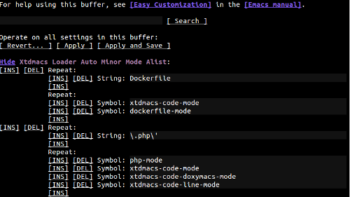
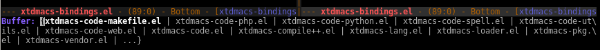
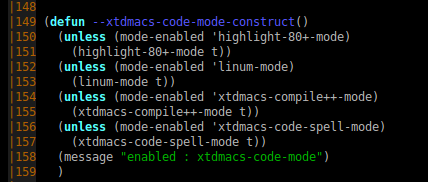
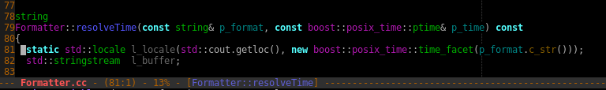
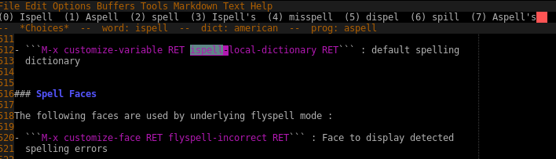

<!-- markdown-toc start - Don't edit this section. Run M-x markdown-toc-refresh-toc -->
**Table of Contents**

- [Introduction](#introduction)
- [Install](#install)
- [Loading modes](#loading-modes)
    - [Manually](#manually)
    - [From ~/.emacs:](#from-emacs)
    - [Using emacs customization](#using-emacs-customization)
    - [Using xtdmacs-loader](#using-xtdmacs-loader)
- [General purpose modes](#general-purpose-modes)
    - [Bindings](#bindings)
        - [Ido](#ido)
        - [Cursor Bindings](#cursor-bindings)
        - [Other bindings](#other-bindings)
    - [File Opener](#file-opener)
    - [Generic code](#generic-code)
        - [Column enforce](#column-enforce)
        - [Line number](#line-number)
        - [Aligning variables and parameters](#aligning-variables-and-parameters)
        - [Code Bindings](#code-bindings)
    - [Compile](#compile)
        - [Window management](#window-management)
        - [Behind the curtain](#behind-the-curtain)
        - [Compile API](#compile-api)
            - [Helper functions](#helper-functions)
            - [Params functions](#params-functions)
            - [Command functions](#command-functions)
        - [Compile Configuration](#compile-configuration)
            - [Standard customization](#standard-customization)
            - [Per project commands](#per-project-commands)
            - [Per mode commands](#per-mode-commands)
        - [Compile Bindings](#compile-bindings)
    - [Line mode](#line-mode)
    - [Spelling](#spelling)
        - [Spell Configuration](#spell-configuration)
        - [Spell Faces](#spell-faces)
        - [Spell API](#spell-api)
        - [Spell Bindings](#spell-bindings)
- [Language specific modes](#language-specific-modes)
    - [C++](#c)
        - [C++ Configuration](#c-configuration)
        - [C++ Faces](#c-faces)
        - [C++ API](#c-api)
        - [C++ Bindings](#c-bindings)
        - [C++ Compilation](#c-compilation)
    - [Go](#go)
        - [Go Configuration](#go-configuration)
        - [Go Faces](#go-faces)
        - [Go API](#go-api)
        - [Go Bindings](#go-bindings)
        - [Go Compilation](#go-compilation)
    - [Python](#python)
        - [Python Faces](#python-faces)
        - [Python API](#python-api)
        - [Python Configuration](#python-configuration)
        - [Python Compilation](#python-compilation)
    - [Php](#php)
        - [Php Faces](#php-faces)
        - [Php Configuration](#php-configuration)
    - [Lisp](#lisp)
        - [Configuration](#configuration)
    - [Json](#json)
        - [Json Bindings](#json-bindings)
        - [Json Compilation](#json-compilation)
    - [Yaml](#yaml)
        - [Yaml Bindings](#yaml-bindings)
        - [Yaml Compilation](#yaml-compilation)
    - [Web](#web)
    - [Makefile](#makefile)
    - [Java](#java)
    - [Javascript](#javascript)
    - [Sphinx](#sphinx)
        - [Sphinx Compilation](#sphinx-compilation)

<!-- markdown-toc end -->

# Introduction

Xtdmacs provides a bunch a development tools and ready-to-use configuration.
Each feature is bundled as a separate minor mode.


# Install

Xtdmacs depends on [yaml-path](https://github.com/psycofdj/yaml-path) which is not yet included
as MELPA package and should be installed manually following [instructions](https://github.com/psycofdj/yaml-path).


The following procedure downloads latest package version and install xtdmacs and
all its dependencies in your elpa directory, usually `~/.emacs.d/elpa`.

 ```bash
 tag=$(curl -s https://api.github.com/repos/psycofdj/xtdmacs/tags | jq -r '[ .[] | .["name"] ] | sort | last')
 wget https://github.com/psycofdj/xtdmacs/archive/${tag}.tar.gz -O xtdmacs-${tag}.tar.gz
 tar xvzf xtdmacs-${tag}.tar.gz
 cd xtdmacs-${tag}
 make install
 ```

# Loading modes

Each mode provided by xtdmacs can be loaded like every other minor mode. However
we recommend to use the xtdmacs-loader described below.

## Manually

`M-x xtdmacs-bindings-mode RET`

## From ~/.emacs:

`(xtdmacs-bindings-mode)`

## Using emacs customization

`M-x customize-variable RET xtdmacs-bindings-mode RET`

## Using xtdmacs-loader

Xtdmacs' package provides is own minor-mode loading system. It is very similar
to default `minor-mode-alist` but allows to define the same mode list
to several file extensions.

This package helps customizing which minors modes should be loaded for each
file extensions.

In order modify associations between file extensions are minor modes, the simpler
is to customize the *xtdmacs-loader-auto-minor-mode-alist* variable.




To enable Xtdmacs' loader, you need to load package at start up :
```elisp
;; in your ~/.emacs
(require 'xtdmacs-loader)
```


# General purpose modes

## Bindings

`xtdmacs-bindings` setup keyboard bindings for the most commonly used features.

### Ido

The ido (Interactively do things) mode provides an efficient way to navigate among
opened buffers. Ido display available buffer names in mini-buffer and filters the
list as you type characters.

swbuff defines functions to directly cycle among existing buffers. It also
provides a way to ignore a list of buffer names in this cycle. Typically,
users will ignore systems buffers like `*Help*` or `*Message*`.

To customize list of ignore buffers :

`M-x customize-variable RET swbuff-exclude-buffer-regexps`

ido completion will also ignore patterns defined in
`swbuff-exclude-buffer-regexps` but will suggest them if typed characters
matches nothing but filtered buffer names.


Example:


| Key                           | Effect                                |
|-------------------------------|---------------------------------------|
| \<ctrl\>+x \<ctrl\>+\<down\>  | Run ido interactive buffer selection  |
| \<left\>                      | (in ido) next buffer suggestion       |
| \<left\>                      | (in ido) previous buffer suggestion   |
| RET                           | (in ido) display selected buffer      |
| \<ctrl\>+x \<ctrl\>+\<right\> | display next buffer                   |
| \<ctrl\>+x \<ctrl\>+\<left\>  | display previous buffer               |


### Cursor Bindings

| Key                           | Effect                                |
|-------------------------------|---------------------------------------|
| \<home\>                      | move cursor to beginning of line      |
| \<select\>                    | move cursor to end of line            |
| \<alt\>+\<up\>                | move cursor to beginning of buffer    |
| \<alt\>+\<down\>              | move cursor to end of buffer          |
| \<ctrl\>+\<left\>             | move cursor to beginning of word      |
| \<ctrl\>+\<right\>            | move cursor to end of word            |
| \<ctrl\>+x \<right\>          | move cursor to the right window       |
| \<ctrl\>+x \<left\>           | move cursor to the left window        |
| \<ctrl\>+x \<up\>             | move cursor to the top window         |
| \<ctrl\>+x \<down\>           | move cursor to the bottom window      |
| \<ctrl\>+x \<ctrl\>+g         | move cursor to given line             |

### Other bindings

| Key                           | Effect                                |
|-------------------------------|---------------------------------------|
| \<ctrl\>+x \<ctrl\>+f         | open file                             |
| \<alt\>+\<plus\>              | enlarge current window's height       |
| \<alt\>+\<minus\>             | shrink current window's height        |
| \<alt\>+\<delete\>            | delete previous word                  |
| \<alt\>+s                     | display speed-bar                     |
| \<alt\>+/                     | auto-complete current word            |
| \<ctrl\>+d                    | search and replace                    |
| \<ctrl\>+f                    | search and replace regexp             |
| \<alt\>+d                     | align regexp                          |
| \<ctrl\>+\<F11\>              | toggle terminal shell                 |
| \<ctrl\>+l                    | insert current date                   |
| \<alt\>+q                     | comment region                        |
| \<alt\>+a                     | uncomment region                      |
| \<F5\>                        | delete buffer's trailing white-spaces |
| \<ctrl\>+\<F5\>               | refresh buffer syntax colors          |
| \<F11\>                       | display menu                          |


## File Opener

`xtdmacs-find` package provides an overload of standard emacs' `find-file`
function. This overload allows to open existing files to specified line and
column number.

```bash
# open file to line 38
$ emacs -nw ~/.emacs:38

# open file to line 38 and column 5
$ emacs -nw ~/.emacs:38:5

# open file normally
$ emacs -nw ~/.emacs

# open unexisting file
$ emacs -nw ~/does_not_exist:20:4
# this will literally open the file named "does_not_exist:20:4"
```

To enable Xtdmacs' find overload, you need to load package at start up :
```elisp
;;in your .emacs:
(require 'xtdmacs-find)
```


## Generic code

`xtdmacs-code-mode` enables multi-language tools that help editing code.

### Column enforce

`column-enforce` colors text beyond a given column, discouraging (but not preventing) the developer
to make too long lines.

To customize column limit :
```
M-x customize-variable RET fill-column RET
```

To customize warning face :
```
M-x customize-face RET column-enforce-face RET
```

### Line number

`linum-mode` displays current line number and fix default window margin



To customize columns number face :
```
M-x customize-face RET linum RET
```

More generally, to customize the linum mode :
```
M-x customize-group RET linum RET
```

### Aligning variables and parameters

xtdmacs-code-mode provides two utility functions that format a specific region
to a **matrix readable** form :

- *xtdmacs-code-align-vars*
- *xtdmacs-code-align-args*

```c++
// given this code snippet :
// mark
void myfunction(const std::string& p_parameter1,
                int p_param2,
                std::vector<std::string>& p_result);
// cursor

// xtdmacs-code-align-args between mark and cursor will produce :
void myfunction(const std::string&        p_parameter1,
                int                       p_param2,
                std::vector<std::string>& p_result);


// given this code snippet :
// mark
  std::cout << "my current process" << l_tmp
            << "is about to fail because of " << l_reason
            << std::endl;
// cursor

// xtdmacs-code-align-args between mark and cursor will produce :
  std::cout << "my current process"           << l_tmp
            << "is about to fail because of " << l_reason
            << std::endl;


// given this code snippet :
void foo(void)
{
// mark
  int l_var1 = 0;
  string l_name = "bar";
  const vector<string> l_contacts = { "foo", "bar" };
// cursor
}


// xtdmacs-code-align-vars between mark and cursor will produce :
void foo(void)
{
  int                  l_var1     = 0;
  string               l_name     = "bar";
  const vector<string> l_contacts = { "foo", "bar" };
}
```


This feature relies on a strict parameter and variables naming convention.
- parameters : `p[cs]?_.* | p[cs]?[A-Z].*`
- variables  : `l[cs]?_.* | l[cs]?[A-Z].*`
- members    : `m[cs]?_.* | m[cs]?[A-Z].*`
- globals    : `g[cs]?_.* | g[cs]?[A-Z].*`
- counters   : `c[cs]?_.* | c[cs]?[A-Z].*`

Note: `c` and `s` optional modifiers stands respectively for const and static


### Code Bindings


| Key                           | Effect                                         |
|-------------------------------|------------------------------------------------|
| \<ctrl\>+\<alt\>+\<up\>       | move cursor to beginning of current expression |
| \<ctrl\>+\<alt\>+\<down\>     | move cursor to end of current expression       |
| \<alt\>+q                     | comment region                                 |
| \<alt\>+a                     | uncomment region                               |
| \<F4\>                        | indent region                                  |
| \<ctrl\>+\<F4\>               | indent buffer                                  |
| \<alt\>+d                     | runs `align-regexp` interactively              |
| \<ctrl\>+\<F1\>               | align variables between mark and cursor        |
| \<ctrl\>+\<F2\>               | align parameters between mark and cursor       |
| \<alt\>+f                     | fold current element using `yafolding-mode`    |
| \<ctrl\>+\<F2\>               | fold all elements using `yafolding-mode`       |


## Compile

`xtdmacs-compile++-mode` wraps the default compilation mode in order to provide a set of
predefined compilation commands. It also allows to use function instead of
plain string as default compile commands.

There is 6 predefined commands : **compile**, **test**, **deploy**, **doc**, **lint** and **manual**
where each commands are meant to be overridden in each specific language modes.

By default, the all run `make -j` in the current directory.

### Window management

xtdmacs-compile++ dedicates a window to the compilation buffer's preventing
emacs to use it to open new files. It also sets this window's height according
to `xtdmacs-compile++-buffer-height` variable and enables optionally
automatic scrolling if `xtdmacs-compile++-scroll-output` is non nil.


### Behind the curtain

The predefined commands are defined in the `xtdmacs-compile++-config-alist` variable.

Where `xtdmacs-compile++-config-alist` is an alist of the form
```lisp
(("<mode-name>" .
    (("<command1>" . config-alist)
     ("<command2>" . config-alist))))
```

and where each *config-alist* is an alist of the form
```lisp
(("get-params" . function)
 ("command"    . string-or-function))
```


The **`<mode-name>`** gives a different configuration for the current major mode.
When current major mode is not found, it falls back to the **default** key which values is given
by `xtdmacs-compile++-default-config-alist`.


The **`<command>`** is one of the pre-defined command **compile**, **test**, **deploy**, **doc**
**lint** and **manual**.

The **`get-params`** function is called interactively to prompt for specific parameters
of the command. Ex. for c++ "compile" command, we prompt for working directory,
optional environment variables and specific script to run.

The **`command`** item build the final command send to default compilation-mode. Ex. for
c++ it will construct something like `cd dir && key=value make -j` from values
prompted by `get-params`.

Usually, **`get-params`** uses `xtdmacs-compile++-config-alist` itself to store values given by
user. It also read defaults values from this variable when ran non interactively.
```lisp
(("compile" .
   (("dir"        . "~/build")
    ("env"        . "VE=1")
    ("bin"        . "make -j 12")
    ("get-params" . xtdmacs-compile++-default-params)
    ("command"    . xtdmacs-compile++-default-command))))
```

### Compile API

This mode provides utility functions that helps building your own `get-params`, `command`
and default functions value.

#### Helper functions

* **`xtdmacs-compile++-get-nearest-filename (name)`** returns the closest path parent
  to current buffer file that contains a file or a directory named *name*

* **`xtdmacs-compile++-get-dir-locals-directory`** returns the path containing
  the nearest .dir-locals.el configuration file (nil if none)

* **`xtdmacs-compile++-get-dir-git`** return the closest parent from buffer containing
  a *.git* directory, often used as project root directory.

* **`xtdmacs-compile++-get-dir-buffer`** returns the directory path of current buffer.

* **`xtdmacs-compile++-guess-directory`** returns the build directory assuming your
  are using automake's VPATH builds in a directory named .release in your project root

* **`xtdmacs-compile++-get-current-branch`** returns (if any) the git branch name of
  the current buffer

#### Params functions

* **`xtdmacs-compile++-default-params(type &optional mode)`**: Prompt
  interactively for a **Directoy**, some **Environement** variables and for
  a **Binary** for the current `type`.
  Defaults values are respectively given by:
  * `"dir"` function/value
  * `"env"` function/value
  * `"bin"` function/value

  In addition, use will be ask if given setting should be store to local buffer or
  across all buffers.

* **`xtdmacs-compile++-current-file-params(type &optional mode)`** : Only
  prompts for a **Binary** and a **File**
  Defaults values are respectively given by:
  * `"bin"` function/value.
  * `"file"` function/value. Note: `buffer-file-name` is often given has
    default value.

* **`xtdmacs-compile++-compose-params(type &optional mode)`** :
  like `xtdmacs-compile++-default-params` but also prompts for :
  * a docker-compose service name, default given by `"service"` function/value
  * a docker-compose file path, default given by `"compose-file"` function/value

* **`xtdmacs-compile++-docker-exec-params(type &optional mode)`** :
  like `xtdmacs-compile++-default-params` but also prompts for :
  * a container name, default given by `"container"` function/value


* **`xtdmacs-compile++-docker-run-params(type &optional mode)`** :
  like `xtdmacs-compile++-default-params` but also prompts for :
  * a docker image name, default given by `"image"` function/value


#### Command functions

* **`xtdmacs-compile++-default-command(type &optional mode)`** : build the command as:
  * `cd <bin> && <env> <bin>`

* **`xtdmacs-compile++-simple-file-command(type &optional mode)`** : build the command as:
  * `<bin> <file>`

* **`xtdmacs-compile++-compose-run-command(type &optional mode)`** : build the command as:
  * `cd <dir> && SRCDIR=<dir> docker-compose -f <compose-file> run --rm [-e <env:key>=<env:val>]* <service> <bin>`

* **`xtdmacs-compile++-compose-exec-command(type &optional mode)`** : build the command as:
  * `cd <dir> && SRCDIR=<dir> docker-compose -f <compose-file> exec <service> <bin>`

* **`xtdmacs-compile++-docker-run-command(type &optional mode)`** : build the command as
  * `docker run --rm=true <image> [-e <env:key>=<env:val>]* /bin/bash -c 'cd <dir> && <bin>'`

* **`xtdmacs-compile++-docker-exec-command(type &optional mode)`** : build the command as
  * `docker exec -t <container> /bin/bash -c 'cd <dir> && <env> <bin>'`


### Compile Configuration

#### Standard customization

Define the number of lines displayed in compilation buffer :
* `M-x customize-variable RET xtdmacs-compile++-buffer-height RET`

Enables automatic scrolling of compilation buffer :
* `M-x customize-variable RET xtdmacs-compile++-scroll-output RET`

Set commands configuration interactively :
* `M-x customize-variable RET xtdmacs-compile++-buffer-local RET`

The following variables targets one of the `xtdmacs-compile++-config-alist` keys.
Each command is bound to a specific keyboard key.
- `M-x customize-variable RET xtdmacs-compile++-command-1 RET` : default `compile`
- `M-x customize-variable RET xtdmacs-compile++-command-2 RET` : default `test`
- `M-x customize-variable RET xtdmacs-compile++-command-3 RET` : default `deploy`
- `M-x customize-variable RET xtdmacs-compile++-command-4 RET` : default `doc`
- `M-x customize-variable RET xtdmacs-compile++-command-5 RET` : default `lint`
- `M-x customize-variable RET xtdmacs-compile++-command-6 RET` : default `manual`

Customize mode-line face when compile process is running :
* `M-x customize-face RET xtdmacs-compile++-compiling-face RET`

Customize mode-line face when compile exited with error :
* `M-x customize-face RET xtdmacs-compile++-error-face RET`

#### Per project commands

Set commands for a specific project :
```lisp
cat ~/.dir-locals.el
("dev/myproject/"
  . ((nil
    . ((xtdmacs-compile++-config-alist
       . (("default
          . (("compile"
             . (("dir"        . xtdmacs-compile++-get-dir-git)
                ("get-params" . xtdmacs-compile++-docker-params)
                ("command"    . xtdmacs-compile++-docker-run-command)
                ("env"        . "")
                ("bin"        . "make -j 12")
                ("service"    . "ws-compile")))
             ("test"
             . (("dir"        . xtdmacs-compile++-get-dir-git)
                ("get-params" . xtdmacs-compile++-docker-params)
                ("command"    . xtdmacs-compile++-docker-run-command)
                ("env"        . "")
                ("bin"        . "make test")
                ("service"    . "ws-rt"))
             ("deploy"
             . (("dir"        . xtdmacs-compile++-get-dir-git)
                ("get-params" . xtdmacs-compile++-docker-params)
                ("command"    . xtdmacs-compile++-docker-run-command)
                ("env"        . "")
                ("bin"        . "sudo -E make install_all")
                ("service"    . "ws-rt"))))))))))))
```

#### Per mode commands

The following example set the `compile` command for the mode `yaml-mode`

```
(defvar my-alist
  '(("compile" .
     (("file"       . buffer-file-name)
      ("bin"        . "yamllint -f parsable -d '{extends: relaxed, rules: {indentation: {spaces: consistent}, line-length: {max: 300}}}'")
      ("get-params" . xtdmacs-compile++-current-file-params)
      ("command"    . xtdmacs-compile++-simple-file-command))))
  )


(xtdmacs-compile++-register-config "yaml-mode" my-alist)
```


### Compile Bindings


| Key                           | Effect                                                                   |
|-------------------------------|--------------------------------------------------------------------------|
| \<F6\>                        | run xtdmacs-compile++-command-1 command (*compile*)                      |
| \<ctrl\>+u \<F6\>             | run xtdmacs-compile++-command-1 command (*compile*), interactive version |
| \<F7\>                        | run xtdmacs-compile++-command-2 command (*test*)                         |
| \<ctrl\>+u \<F7\>             | run xtdmacs-compile++-command-2 command (*test*), interactive version    |
| \<F8\>                        | run xtdmacs-compile++-command-3 command (*deploy*)                       |
| \<ctrl\>+u \<F8\>             | run xtdmacs-compile++-command-3 command (*deploy*), interactive version  |
| \<ctrl\>+\<F6\>               | run xtdmacs-compile++-command-4 command (*doc*)                          |
| \<ctrl\>+u \<ctrl\>+\<F6\>    | run xtdmacs-compile++-command-4 command (*doc*), interactive version     |
| \<ctrl\>+\<F7\>               | run xtdmacs-compile++-command-5 command (*lint*)                         |
| \<ctrl\>+u \<ctrl\>+\<F7\>    | run xtdmacs-compile++-command-5 command (*lint*), interactive version    |
| \<ctrl\>+\<F8\>               | run xtdmacs-compile++-command-6 command (*manual*)                       |
| \<ctrl\>+u \<ctrl\>+\<F8\>    | run xtdmacs-compile++-command-6 command (*manual*), interactive version  |
| \<alt\>+\<F6\>                | kill running process                                                     |
| \<alt\>+\<F7\>                | kill running process                                                     |
| \<alt\>+\<F8\>                | kill running process                                                     |
| \<F9>                         | goto next compile error                                                  |
| \<ctrl\>+\<F9>                | goto next compile error or warning                                       |


## Line mode

`xtdmacs-code-line-mode` tweaks the `mode-line` format in order to display :
- **`buffer name`**:  with the customizable face `mode-line-buffer-id`
- **`line`** and **`column`** of current point position
- **`percentage`** of the current buffer scroll
- **`function name`**, if any, or the current `buffer directory`

The function name is deduces by **`which-func-mode`** which is customizable with
the following command:

`C-u M-x customize-mode RET which-func-mode RET`


Example:




## Spelling

`xtdmacs-code-spell-mode` and `xtdmacs-code-spell-prog-mode` are wrapping of **`flyspell-mode`**
and **`flyspell-prog-mode`**. They both detected spelling error in current buffer.
The first analyzes all available text and the second only analyzes strings and comment.

### Spell Configuration

The modes are affected by the following customizable variables :

- `M-x customize-variable RET xtdmacs-code-spell-ignore-regexp RET` : list of
  regexp patterns to ignore while spelling the buffer.

- `M-x customize-variable RET xtdmacs-code-spell-max-lines RET` : maximum
  allowed buffer lines to automatically run flyspell on buffer.

- `M-x customize-variable RET ispell-local-dictionary RET` : default spelling
  dictionary


### Spell Faces

The following faces are used by underlying flyspell mode :

- `M-x customize-face RET flyspell-incorrect RET` : Face to display detected
  spelling errors

- `M-x customize-face RET flyspell-duplicate RET` : Face to display detected
  duplicated words.


### Spell API

Useful functions :

- `M-X flyspell-buffer RET` : refresh spelling analysis of current buffer

- `M-X xtdmacs-code-spell-change-dictionary RET` : changes spelling dictionary
  and set new dictionary are local file variable.

- `M-X xtdmacs-code-spell-next-word RET` : interactively correct the next
  detected error

- `M-X xtdmacs-code-spell-prev-word RET` : interactively correct the previous
  detected error

### Spell Bindings

| Key                           | Effect                                 |
|-------------------------------|----------------------------------------|
| \<ctrl\>+c \<ctrl\>+c         | `xtdmacs-code-spell-change-dictionary` |
| \<ctrl\>+c \<ctrl\>+\<down\>  | `flyspell-buffer`                      |
| \<ctrl\>+c \<ctrl\>+\<right\> | `xtdmacs-code-spell-next-word`         |
| \<ctrl\>+c \<ctrl\>+\<left\>  | `xtdmacs-code-spell-prev-word`         |




# Language specific modes

## C++

`xtdmacs-code-cpp-mode` provides the following features :

- **Fix -std=c++11 enum class** : Aging c++-mode doesn't handle new enum
  class syntax available in c++11 and leads to a broken indentation. This minor
  mode fixes `c-offsets-alist` and properly indents this structure.

- **Cycling through headers and implementation files** : When editing a c++ header
  (.hh), we often need to visit the corresponding implementation (.cc) and vice
  versa. The mode defines a function that searches for file that matches current
  buffer file name with the correct extension. Another function does the same but
  creates the file if it doesn't already exist. Because c++ extensions are not
  well standardized, you can set the list of searched extension in the variable
  `xtdmacs-code-cpp-header-extensions` .

- **Automatic indentation** : The mode offers to automatically indent
  the whole buffer at open and/or at close. (*)

  (*) Personnal note : Emacs is the best market product for editing and indenting
  code. Sadly, not everybody uses Emacs and real world code is often poorly indented.
  This usage is certainly highly arguable but I've been using this in industrial
  collaborative environment for the past ten years and automatic code indentation
  solved far more problems than it has created.

- **Keywords** : The mode provides many font-lock additional keywords. Some of them
  try to catch the new C++11/14 language keywords like `nullptr` or
  `decltype` or `utf-8 strings` . Others define font-lock rules to color
  particular naming patterns, allowing to easily distinguish local variables,
  parameter, class members, const and static attributes without need to use
  heavy syntax analyzers that often need to actually compile the code.

- **Renaming variables** : The mode defines a function that generated the correct
  `query-replace-regexp` call to rename symbol at point to match one of the
  prefix rule defined for local variable, parameters or class member syntax
  coloring.

- **Completion** : The mode integrates [irony](https://github.com/Sarcasm/irony-mode)
  and [auto-complete](https://github.com/auto-complete/auto-complete) to provide
  C++ code completion. `xtdmacs-code-cpp-complete-irony-async` is bound to
  `M-.` by default.

  Completion is asynchronous, buffer name will be colored  with
  `xtdmacs-code-cpp-ac-irony-working-face` until completion is ready. First call
  may be quite long, further calls are cached by server and will return immediately.

  It relies on a completion server provided by irony which can be automatically
  installed using `M-x irony-install-server RET`.

  In addition, `irony-get-type` bound to `C-e` keys prints the type of symbol
  under cursor in the minibuffer.

### C++ Configuration

- `M-x customize-variable RET xtdmacs-code-cpp-indent-load-auto RET` : tells
  if buffer should be automatically indented at load.

- `M-x customize-variable RET xtdmacs-code-cpp-indent-save-auto RET` :  tells
  if buffer should be automatically indented at save.

- `M-x customize-variable RET xtdmacs-code-cpp-header-extensions RET` : defines
  the list of extensions that are searched when cycling through headers and
  implementation files. Note: this list can have more than two elements, this is
  useful to handle template implementations or inline definition files like
  `.hpp` or `.hxx` .

- `M-x customize-variable RET xtdmacs-code-cpp-keywords-alist RET` : alist of
  keywords and faces to add to font-lock when mode is activated.

### C++ Faces

The mode uses faces defined in `xtdmacs-code-mode`. See
`M-x customize-group RET code RET` .

### C++ API

- `M-x xtdmacs-code-cpp-header-cycle RET` : cycle through extensions defined
  by `xtdmacs-code-cpp-header-extensions` .

- `M-x xtdmacs-code-cpp-header-cycle-create RET` : cycle through extensions defined
  by `xtdmacs-code-cpp-header-extensions`, create files if they don't exist.

- `M-x xtdmacs-code-cpp-rename-variable RET` : rename variable under cursor. The
  function prompt interactively for renaming prefix.

- `M-x irony-get-type RET` : display in minibuffer the type of the symbol under
  cursor.

- `M-x xtdmacs-code-cpp-complete-irony-async RET` : trigger completion at current point.

### C++ Bindings

| Key                           | Effect                                                             |
|-------------------------------|--------------------------------------------------------------------|
| \<F12\>                       | `xtdmacs-code-cpp-header-cycle`                                |
| \<ctrl\>+\<F12\>              | `xtdmacs-code-cpp-header-cycle` (create file if dosen't exist) |
| \<ctrl\>+c \<ctrl>+e          | `xtdmacs-code-cpp-rename-variable`                             |
| \<ctrl\>+e                    | `irony-get-type`                                               |
| \<alt\>+.                     | `xtdmacs-code-cpp-complete-irony-async`                        |


### C++ Compilation

Commands are set by `xtdmacs-code-cpp-compile-alist` which can be customized by running:
* `M-x customize-variable RET xtdmacs-code-cpp-compile-alist RET`

By default `xtdmacs-code-cpp-compile-alist` takes the value of
`xtdmacs-compile++-default-config-alist`.


## Go

`xtdmacs-code-minor-mode` provides the following features:

* **Keywords**: define font-lock rules to color particular naming patterns, allowing to easily
  distinguish local variables, parameter... etc.

* **Completion**: Integrates [gocode](https://github.com/mdempsky/gocode) which must be manually
  installed

* **Formatting**: Provides automatic formatting functions, on-demand or at load/save

* **Snippets**: Loads default go language snippets

* **Compilation**: Provides default commands for compilation and linter checking


### Go Configuration

* `M-x customize-variable RET xtdmacs-code-go-keywords-alist RET`
* `M-x customize-variable RET xtdmacs-code-go-indent-load-auto RET`
* `M-x customize-variable RET xtdmacs-code-go-indent-save-auto RET`

### Go Faces

* `M-x customize-face RET xtdmacs-code-go-face-indent-error RET`

### Go API

* `xtdmacs-code-go-format-region`: (interactive) applies `gofmt` on current region
* `xtdmacs-code-go-get-project-name`: compute and returns current go package name
* `xtdmacs-code-go-command`: generates a `go build` command from current compilation configuration

### Go Bindings

| Key              | Effect                                             |
|------------------|----------------------------------------------------|
| \<alt\>+t        | format region using `gofmt`                        |
| \<ctrl\>+<alt>+t | format buffer using `gofmt`                        |
| \<alt\>+.        | completion at point                                |
| \<ctrl\>+e       | print documentation for symbol at point            |
| \<alt\>+e        | interactively query go documentation               |
| f12              | go to definition of symbol at point                |
| \<ctrl\>+f12     | go to definition of symbol at point (other-window) |


### Go Compilation

* **`compile`**: Runs `go build` from top git directory. Output binary name is computed
  from current package name.

* **`lint`**: runs [gometalinter](https://github.com/alecthomas/gometalinter) on current package.
  gometalinter must be installed manually.

## Python

`xtdmacs-code-python-mode` provides the following features :

- Automatic indentation on load and/or save

- Overrides default xtdmacs-compile++ configuration :
  - run pylint on current buffer
  - run unittest script

- Defines font-lock keywords to identify local variables, parameters and class
  members

- Defines useful functions used in compilation commands

### Python Faces

The mode uses faces defined in `xtdmacs-code-mode`.

### Python API

- `xtdmacs-code-python-module-root` : Returns buffers' most distant parent directory
  containing a `___init__.py` file. If no such file found, returns buffer's
  file directory.

- `xtdmacs-code-python-project-root` : Returns parent directory of module root. If
  module root couldn't be identified, returns buffer's file directory.

- `xtdmacs-code-python-pylint-getargs` : Constructs argument string to pass to
  compile command. If `.pylintrc` is found in project root, includes
  `--rcfile=file` in constructed string.

- `xtdmacs-code-python-pylint-bin` Constructs compile command from
  `xtdmacs-code-python-pylint-bin-path` and `xtdmacs-code-python-pylint-args`.
  The buffer's file path is added as last  argument on the returned command.

- `xtdmacs-code-python-test-bin` Constructs compile command from
  `xtdmacs-code-python-test-bin-path` and `xtdmacs-code-python-test-args`.

- `xtdmacs-code-python-params` : same as `xtdmacs-compile++-default-params`,
  prompt only for directory and binary command.

- `xtdmacs-code-python-command` : same as `xtdmacs-compile++-default-command`,
  construct final compile command from parameters built by
  `xtdmacs-code-python-params` .

### Python Configuration

- `M-x customize-variable RET xtdmacs-code-python-pylint-bin-path RET`
  - pylint static code checker file path

- `M-x customize-variable RET xtdmacs-code-python-pylint-args RET`
  - Static string or function to use as pylint script argument

- `M-x customize-variable RET xtdmacs-code-python-test-bin-path RET`
  - Unit test runner file path. If nil, use default xtdmacs runner

- `M-x customize-variable RET xtdmacs-code-python-test-args RET`
  - Static string or function to use as test binary arguments

- `M-x customize-variable RET xtdmacs-code-python-indent-save-auto RET`
  - Enables python code auto-indentation on save.

- `M-x customize-variable RET xtdmacs-code-python-indent-load-auto RET`
  - Enables python code auto-indentation on load.

- `M-x customize-variable RET xtdmacs-code-python-keywords-alist RET`
  - List of additional python font-lock keywords

- `M-x customize-variable RET xtdmacs-code-python-compile-alist RET`
  - overrides `xtdmacs-compile++-config-alist` for `python-mode`

### Python Compilation

Commands are set by `xtdmacs-code-python-compile-alist` which can be customized by running:
* `M-x customize-variable RET xtdmacs-code-python-compile-alist RET`

* **`compile`**: run [pylint](https://www.pylint.org/) on project root. Root is deduced by
  walking buffer's parent directory until no `__init__.py` file is found.

  Pylint configuration is searched by order of priority in the following locations:
  * `<root>/.pylintrc`
  * `${HOME}/.pylintrc`
  * `<xtdmacs_installdir>/vendor/pylintrc`

* **`test`**: run unittests. Binary is given by `xtdmacs-code-python-test-bin-path` and
  defaults to `<xtdmacs_installdir>/bin/unittests.py` which is a default python unittest wrapper
  that produces a parsable output.


Full definition
```lisp
'(("compile" .
     (("dir"        . xtdmacs-code-python-project-root)
      ("bin"        . xtdmacs-code-python-pylint-bin)
      ("env"        . "")
      ("get-params" . xtdmacs-compile++-default-params)
      ("command"    . xtdmacs-compile++-default-command)))
    ("test" .
     (("dir"        . xtdmacs-code-python-project-root)
      ("bin"        . xtdmacs-code-python-test-bin)
      ("env"        . "")
      ("get-params" . xtdmacs-compile++-default-params)
      ("command"    . xtdmacs-compile++-default-command))))
```


## Php

`xtdmacs-code-php-mode`  provides de following features :
- Fix anonymous function indentation introduced in PHP 5.3.0

- Sets default doxymacs comment template `doxymacs-function-comment-template`
  to phpdoc compatible `xtdmacs-code-doxymacs-template-phpdoc`.

- Adds font-lock keywords to identify local variables, parameters and class members

- Fixes syntax table for a better work boundary detection

- Automatic indentation on buffer load and/or save

### Php Faces

In addition to faces defined in `xtdmacs-code-mode`. (See
`M-x customize-group RET code RET` ), the mode defines :

- `M-x customize-face RET xtdmacs-code-php-operator RET` : Used to fontify PHP
  language operators such as ';' or '::'"


### Php Configuration

- `M-x customize-variable RET xtdmacs-code-php-indent-load-auto RET` : Enables
  code auto-indentation on buffer load.

- `M-x customize-variable RET xtdmacs-code-php-indent-save-auto RET` : Enables
  code auto-indentation on buffer save.


## Lisp

`xtdmacs-code-lisp-mode` provides automatic indentation on load and save.

### Configuration

- `M-x customize-variable RET xtdmacs-code-lisp-indent-load-auto RET` : Enables
  code auto-indentation on buffer load.

- `M-x customize-variable RET xtdmacs-code-lisp-indent-save-auto RET` : Enables
  code auto-indentation on buffer save.

## Json

`xtdmacs-code-json-mode` loads `json-mode`, sets defaults `js-indent-level` to 2 and defines default compilation
command.

### Json Bindings

| Key                           | Effect                              |
|-------------------------------|-------------------------------------|
| \<ctrl\>+c \<ctrl\>+f         | beautify-buffer                     |
| \<ctrl\>+c \<ctrl\>+p         | show json path at point             |

### Json Compilation

Commands are set by `xtdmacs-code-json-compile-alist` which can be customized by running:
* `M-x customize-variable RET xtdmacs-code-json-compile-alist RET`

* **`compile`** : runs `jsonlint-php` on current  buffer

Full definition:

```lisp
  '(("compile" .
     (("file"       . buffer-file-name)
      ("bin"        . "jsonlint-php -q")
      ("get-params" . xtdmacs-compile++-current-file-params)
      ("command"    . xtdmacs-compile++-simple-file-command)))
    )
```

## Yaml

`xtdmacs-code-yaml-mode` integrates [yaml-path](https://github.com/psycofdj/yaml-path) to
`which-function-mode` and define default compilation settings.

### Yaml Bindings

| Key                           | Effect                              |
|-------------------------------|-------------------------------------|
| \<ctrl\>+e                    | prints yaml path under cursor       |


### Yaml Compilation

Commands are set by `xtdmacs-code-yaml-compile-alist` which can be customized by running:
* `M-x customize-variable RET xtdmacs-code-yaml-compile-alist RET`

* **`compile`** : Runs [yamllint](https://github.com/adrienverge/yamllint) on current buffer

Full definition:

```lisp
  '(("compile" .
     (("file"       . buffer-file-name)
      ("bin"        . "yamllint -f parsable -d '{extends: relaxed, rules: {indentation: {spaces: consistent}, line-length: {max: 300}}}'")
      ("get-params" . xtdmacs-compile++-current-file-params)
      ("command"    . xtdmacs-compile++-simple-file-command)))
    )
```


## Web

`xtdmacs-code-web-mode` overrides default `comment-start` and `comment-end` that are
poorly set by `web-mode`.

## Makefile

`xtdmacs-code-makefile-mode` highlights tabs with `hi-yellow` face.

## Java

`xtdmacs-code-java-mode` adds font-lock keywords :
`M-x customize-variable RET xtdmacs-code-java-keywords-alist RET`

## Javascript

`xtdmacs-code-js-mode` adds font-lock keywords :
`M-x customize-variable RET xtdmacs-code-js-keywords-alist RET`

## Sphinx

`xtdmacs-code-sphinx-mode` set compilation settings for `rst-mode`.  It also turns
off `electric-indent-mode` which appear to not work very properly with reStructuredText.

### Sphinx Compilation


Commands are set by `xtdmacs-code-sphinx-compile-alist` which can be customized by running:
* `M-x customize-variable RET xtdmacs-code-sphinx-compile-alist RET`

* **`compile`** : Generates sphinx documentation by:
  - searching for directory containing conf.py as compile directory
  - detects compile command as follow :
    - `make html` when compile directory has a Makefile
    - `sphinx-build -M html . build` otherwise

Full definition:
```lisp
  '(("compile" .
     (("dir"        . xtdmacs-code-sphinx-project-root)
      ("bin"        . xtdmacs-code-sphinx-bin)
      ("env"        . "")
      ("get-params" . xtdmacs-compile++-default-params)
      ("command"    . xtdmacs-compile++-default-command))))
```


<!-- LocalWords:  xtdmacs config alist RET params cd dir env API dev toc wget -->
<!-- LocalWords:  param filename automake's VPATH sudo ctrl goto xvzf ido fci -->
<!-- LocalWords:  swbuff multi linum doxymacs flyspell reStructuredText -->
<!-- Local Variables: -->
<!-- ispell-local-dictionary: "american" -->
<!-- End: -->
