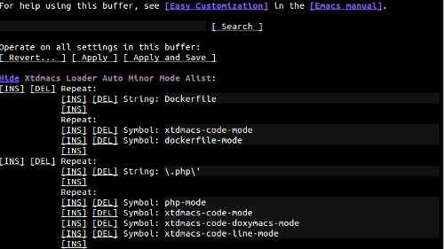
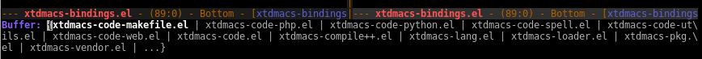
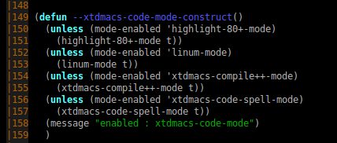
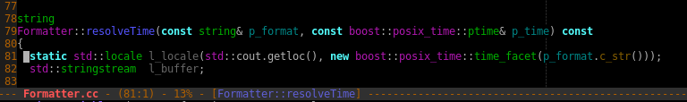
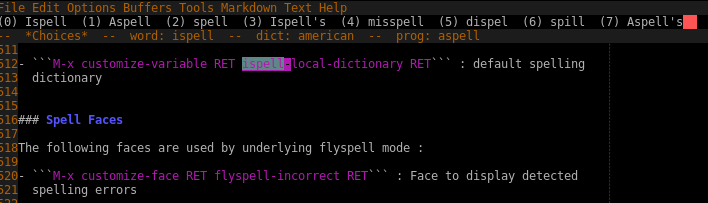

<!-- markdown-toc start - Don't edit this section. Run M-x markdown-toc-refresh-toc -->
**Table of Contents**

- [Introduction](#introduction)
- [Install](#install)
- [Loading modes](#loading-modes)
- [General purpose modes](#general-purpose-modes)
    - [Bindings](#bindings)
        - [Cursor bindings](#cursor-bindings)
        - [Other bindings](#other-bindings)
    - [File opener](#file-opener)
    - [Generic code](#generic-code)
        - [Column enforce](#column-enforce)
        - [Line numbers](#line-numbers)
        - [Aligning variables and parameters](#aligning-variables-and-parameters)
        - [Code bindings](#code-bindings)
    - [Compile](#compile)
        - [Window management](#window-management)
        - [How it works](#how-it-works)
        - [Compile API](#compile-api)
            - [Helper functions](#helper-functions)
            - [Params functions](#params-functions)
            - [Command functions](#command-functions)
        - [Compile configuration](#compile-configuration)
            - [Standard customization](#standard-customization)
            - [Per-project commands](#per-project-commands)
            - [Per-mode commands](#per-mode-commands)
        - [Compile bindings](#compile-bindings)
    - [Mode line](#mode-line)
    - [Spelling](#spelling)
- [Language specific modes](#language-specific-modes)
    - [C++](#c)
    - [Go](#go)
    - [Python](#python)
    - [TypeScript](#typescript)
    - [Terraform](#terraform)
    - [PHP](#php)
    - [Lisp](#lisp)
    - [Shell](#shell)
    - [JSON](#json)
    - [YAML](#yaml)
    - [Web](#web)
    - [Makefile](#makefile)
    - [Java](#java)
    - [JavaScript](#javascript)
    - [Sphinx / reStructuredText](#sphinx--restructuredtext)

<!-- markdown-toc end -->

# Introduction

Xtdmacs is a bundle of opinionated Emacs development tools. Each feature is
packaged as an independent setup function or minor mode, so you can pick what
you need and ignore the rest. It ships:

- a generic editing layer (alignment, indent, column highlight, line numbers, spell-check)
- a **compilation framework** (`xtdmacs-compile++`) that generalizes `:compile`,
  `:test`, `:deploy`, `:doc`, `:lint`, `:manual` commands per project / per mode,
  including Docker / docker-compose helpers
- per-language setups for C++, Go, Python, TypeScript, Terraform, PHP, Lisp,
  Shell, JSON, YAML, Web, Makefile, Java, JavaScript and Sphinx
- a file extension → mode dispatcher (`xtdmacs-loader`)
- a `find-file` overload that understands `path:line[:column]` syntax

# Install

Xtdmacs is distributed as an Emacs package archive. Build and install with:

```bash
git clone https://github.com/psycofdj/xtdmacs.git
cd xtdmacs
make install
```

`make install` imports the package's GPG signing key, builds the tarball,
removes any prior `~/.emacs.d/elpa/xtdmacs*` install and runs an Emacs batch
job that installs xtdmacs and all its package dependencies. Use
`make install-quick` to skip the package-archive refresh.

External binaries are required for some language modes (only when you use them):
`pylint`, `shellcheck`, `jsonlint-php`, `yamllint`, `terraform`, `gofmt`,
`sphinx-build`, `npm`, the `irony-server` (`M-x irony-install-server`).

# Loading modes

Each language setup hooks itself onto its major mode automatically when its
file is `require`d. The recommended entry point is `xtdmacs-loader`, which
maps file extensions to major modes and triggers the right xtdmacs setup
hooks (spell-check, mode-line, …) for each.

```elisp
;; in your ~/.emacs
(require 'xtdmacs-loader)
(require 'xtdmacs-bindings)
(require 'xtdmacs-find)
(xtdmacs-bindings-mode)
```

To customize the file extension → major mode association:

```
M-x customize-variable RET xtdmacs-loader-auto-major-mode-alist RET
```



You can still load any individual language setup directly, e.g.
`(require 'xtdmacs-code-cpp)` or `(require 'xtdmacs-code-typescript)`.

# General purpose modes

## Bindings

`xtdmacs-bindings-mode` is a global minor mode that installs the keybindings
listed below and turns on `ido-mode` for buffer switching.

[`ido`](https://www.emacswiki.org/emacs/InteractivelyDoThings) shows
matching buffer names in the minibuffer and filters them as you type.
Buffers in `ido-ignore-buffers` are demoted but still selectable when nothing
else matches. Customize the ignore list with:

```
M-x customize-variable RET ido-ignore-buffers RET
```



| Key                       | Effect                                |
|---------------------------|---------------------------------------|
| `C-x C-<down>`            | ido buffer selection                  |
| `<right>` / `<left>`      | (in ido) next / previous suggestion   |
| `RET`                     | (in ido) display selected buffer      |
| `C-x C-<right>`           | next buffer (iflipb)                  |
| `C-x C-<left>`            | previous buffer (iflipb)              |

### Cursor bindings

| Key             | Effect                            |
|-----------------|-----------------------------------|
| `<home>`        | beginning of line                 |
| `<select>`      | end of line                       |
| `M-<up>`        | beginning of buffer               |
| `M-<down>`      | end of buffer                     |
| `C-<left>`      | beginning of word                 |
| `C-<right>`    | end of word                       |
| `C-x <right>`   | move to right window              |
| `C-x <left>`    | move to left window               |
| `C-x <up>`      | move to top window                |
| `C-x <down>`    | move to bottom window             |
| `C-x C-g`       | goto line                         |

### Other bindings

| Key             | Effect                                    |
|-----------------|-------------------------------------------|
| `C-x C-f`       | open file (xtdmacs-find, see below)       |
| `M-+`           | enlarge current window                    |
| `M--`           | shrink current window                     |
| `M-<delete>`    | delete previous word (no kill-ring)       |
| `M-s`           | toggle speedbar                           |
| `M-/`           | dabbrev complete                          |
| `C-d`           | search and replace                        |
| `C-f`           | search and replace (regexp)               |
| `M-d`           | align by regexp                           |
| `C-<F11>`       | toggle terminal shell                     |
| `C-l`           | insert current date                       |
| `M-q`           | comment region                            |
| `M-a`           | uncomment region                          |
| `<F5>`          | strip trailing whitespace                 |
| `C-<F5>`        | refresh font-lock colors                  |
| `<F11>`         | display menu                              |

## File opener

`xtdmacs-find` advises `find-file-noselect` so files can be opened at a
specific location using `path:line` or `path:line:column`. Useful when
pasting compiler / grep output:

```bash
emacs -nw ~/.emacs:38       # open at line 38
emacs -nw ~/.emacs:38:5     # open at line 38, column 5
emacs -nw ~/does_not_exist  # falls through to normal find-file
```

If a file literally named `foo:20:4` exists, it is opened as-is.

```elisp
(require 'xtdmacs-find)
```

## Generic code

`xtdmacs-code` is the shared base for every language setup. It provides
font-lock faces (variables, parameters, members, counters, return values, …),
indent/format/align utilities and the bindings below — all installed via the
per-language setup functions.

### Column enforce

[`column-enforce-mode`](https://github.com/jordonbiondo/column-enforce-mode)
colors text past `fill-column` to discourage long lines without rewrapping.

```
M-x customize-variable RET fill-column RET
M-x customize-face RET column-enforce-face RET
```

### Line numbers

Buffer line numbers are displayed via Emacs' built-in `display-line-numbers-mode`.



```
M-x customize-face RET line-number RET
M-x customize-face RET line-number-current-line RET
```

### Aligning variables and parameters

Two functions reformat a region into a "matrix-like" layout:

- `xtdmacs-code-align-vars` — for local variable declarations
- `xtdmacs-code-align-args` — for parameter lists / chained operators

```c++
// xtdmacs-code-align-args between mark and cursor :
void myfunction(const std::string&        p_parameter1,
                int                       p_param2,
                std::vector<std::string>& p_result);

  std::cout << "my current process"           << l_tmp
            << "is about to fail because of " << l_reason
            << std::endl;

// xtdmacs-code-align-vars between mark and cursor :
{
  int                  l_var1     = 0;
  string               l_name     = "bar";
  const vector<string> l_contacts = { "foo", "bar" };
}
```

`align-vars` relies on a Hungarian-style naming convention (`[cs]?` = optional
const / static modifier):

| Kind       | Pattern                              |
|------------|--------------------------------------|
| parameter  | `p[cs]?_.*` or `p[cs]?[A-Z].*`       |
| local      | `l[cs]?_.*` or `l[cs]?[A-Z].*`       |
| member     | `m[cs]?_.*` or `m[cs]?[A-Z].*`       |
| global     | `g[cs]?_.*` or `g[cs]?[A-Z].*`       |
| counter    | `c[cs]?_.*` or `c[cs]?[A-Z].*`       |

### Code bindings

| Key             | Effect                                       |
|-----------------|----------------------------------------------|
| `C-M-<up>`      | beginning of current sexp                    |
| `C-M-<down>`    | end of current sexp                          |
| `M-q`           | comment region                               |
| `M-a`           | uncomment region                             |
| `<F4>`          | indent region                                |
| `C-<F4>`        | indent buffer                                |
| `M-d`           | `align-regexp` interactive                   |
| `C-<F1>`        | align variables (mark → cursor)              |
| `C-<F2>`        | align parameters (mark → cursor)             |
| `M-f`           | toggle fold (`yafolding-mode`)               |

## Compile

`xtdmacs-compile++` wraps the standard `compilation-mode` with a small
abstraction: every project / mode advertises up to **six** named commands
(`:compile`, `:test`, `:deploy`, `:doc`, `:lint`, `:manual`), each of which
is mapped to an F-key. By default each command runs `make -j` in the buffer's
directory.

A command can be a plain string or a function — that's how the package
provides ready-to-use Docker, docker-compose and per-language compile
behaviour.

### Window management

The compilation buffer is shown in a dedicated window whose height is
controlled by `xtdmacs-compile++-buffer-height`. Auto-scrolling is governed
by `xtdmacs-compile++-scroll-output`. Output is colorized via `xterm-color`.

The mode-line is recolored while a command is running
(`xtdmacs-compile++-compiling-face`) and on failure
(`xtdmacs-compile++-error-face`).

### How it works

Configurations are stored in `xtdmacs-compile++-config-alist`:

```elisp
(("<mode-name>"
  (:<command1> . config-alist)
  (:<command2> . config-alist)))
```

Each `config-alist` describes how to build the shell command:

```elisp
((:get-params . function)   ;; interactive prompt for params
 (:command    . function-or-string))  ;; final command builder
```

`<mode-name>` matches the current major mode; if no entry is found the
fallback is the `default` key, which holds
`xtdmacs-compile++-default-config-alist`.

`:get-params` is called interactively and prompts for the parameters
the `:command` builder needs. For most commands these are `:dir`, `:env`
and `:bin`; Docker variants also ask for `:service`, `:container` or
`:image`. Default values are read from the same config:

```elisp
(:compile
 (:dir        . "~/build")
 (:env        . "VE=1")
 (:bin        . "make -j 12")
 (:get-params . xtdmacs-compile++-default-params)
 (:command    . xtdmacs-compile++-default-command))
```

When prompted, you decide whether the values are saved buffer-locally or
globally for the mode.

### Compile API

#### Helper functions

| Function                                          | Purpose                                                        |
|---------------------------------------------------|----------------------------------------------------------------|
| `xtdmacs-compile++-get-nearest-filename(name)`    | walk up tree looking for file/dir `name`                       |
| `xtdmacs-compile++-get-dir-buffer`                | directory of current buffer                                    |
| `xtdmacs-compile++-get-dir-git`                   | nearest parent containing `.git` (project root)                |
| `xtdmacs-compile++-get-dir-locals-directory`      | nearest parent containing `.dir-locals.el`                     |
| `xtdmacs-compile++-guess-directory`               | VPATH build dir (uses `xtdmacs-compile++-iwyu-build-directory-name`) |
| `xtdmacs-compile++-get-current-branch`            | git branch of current buffer                                   |

#### Params functions

| Function                                | Prompts for                                                         |
|-----------------------------------------|---------------------------------------------------------------------|
| `xtdmacs-compile++-default-params`      | `:dir`, `:env`, `:bin`                                              |
| `xtdmacs-compile++-current-file-params` | `:bin`, `:file` (`buffer-file-name` by default)                     |
| `xtdmacs-compile++-compose-params`      | default + `:service` + `:compose-file`                              |
| `xtdmacs-compile++-docker-run-params`   | default + `:image`                                                  |
| `xtdmacs-compile++-docker-exec-params`  | default + `:container`                                              |

#### Command functions

| Function                                  | Produces                                                           |
|-------------------------------------------|--------------------------------------------------------------------|
| `xtdmacs-compile++-default-command`       | `cd :dir && :env :bin`                                             |
| `xtdmacs-compile++-simple-file-command`   | `:bin :file`                                                       |
| `xtdmacs-compile++-compose-run-command`   | `cd :dir && SRCDIR=:dir docker-compose -f :compose-file run --rm [-e :env]* :service :bin` |
| `xtdmacs-compile++-compose-exec-command`  | `cd :dir && SRCDIR=:dir docker-compose -f :compose-file exec :service :bin`                |
| `xtdmacs-compile++-docker-run-command`    | `docker run --rm=true :image [-e :env]* /bin/bash -c 'cd :dir && :bin'` |
| `xtdmacs-compile++-docker-exec-command`   | `docker exec -t :container /bin/bash -c 'cd :dir && :env :bin'`    |

### Compile configuration

#### Standard customization

| Variable                              | Purpose                                          |
|---------------------------------------|--------------------------------------------------|
| `xtdmacs-compile++-buffer-height`     | Lines shown in compilation window                |
| `xtdmacs-compile++-scroll-output`     | Auto-scroll while running                        |
| `xtdmacs-compile++-command-1` … `-6`  | Map F-keys → command keys (see bindings below)   |
| `xtdmacs-compile++-default-config-alist` | Fallback config for modes without a registration |

Default mapping:

| Variable                       | Default key  |
|--------------------------------|--------------|
| `xtdmacs-compile++-command-1`  | `:compile`   |
| `xtdmacs-compile++-command-2`  | `:test`      |
| `xtdmacs-compile++-command-3`  | `:deploy`    |
| `xtdmacs-compile++-command-4`  | `:doc`       |
| `xtdmacs-compile++-command-5`  | `:lint`      |
| `xtdmacs-compile++-command-6`  | `:manual`    |

#### Per-project commands

Drop a `.dir-locals.el` at the project root:

```elisp
(("dev/myproject/"
  . ((nil
     . ((xtdmacs-compile++-config-alist
         . (("default"
             . ((:compile
                 . ((:dir        . xtdmacs-compile++-get-dir-git)
                    (:get-params . xtdmacs-compile++-docker-run-params)
                    (:command    . xtdmacs-compile++-docker-run-command)
                    (:env        . "")
                    (:bin        . "make -j 12")
                    (:image      . "myorg/build:latest")))
                (:test
                 . ((:dir        . xtdmacs-compile++-get-dir-git)
                    (:get-params . xtdmacs-compile++-compose-params)
                    (:command    . xtdmacs-compile++-compose-run-command)
                    (:env        . "")
                    (:bin        . "make test")
                    (:service    . "ws-rt"))))))))))))
```

#### Per-mode commands

Register a config for a major mode at load time:

```elisp
(defvar my-yaml-compile-alist
  '((:compile
     . ((:file       . buffer-file-name)
        (:bin        . "yamllint -f parsable")
        (:get-params . xtdmacs-compile++-current-file-params)
        (:command    . xtdmacs-compile++-simple-file-command)))))

(xtdmacs-compile++-register-config "yaml-mode" my-yaml-compile-alist)
```

### Compile bindings

| Key            | Effect                                   |
|----------------|------------------------------------------|
| `<F6>`         | command-1 (default `:compile`)           |
| `C-u <F6>`     | command-1, prompt for params             |
| `<F7>`         | command-2 (default `:test`)              |
| `C-u <F7>`     | command-2, prompt for params             |
| `<F8>`         | command-3 (default `:deploy`)            |
| `C-u <F8>`     | command-3, prompt for params             |
| `C-<F6>`       | command-4 (default `:doc`)               |
| `C-<F7>`       | command-5 (default `:lint`)              |
| `C-<F8>`       | command-6 (default `:manual`)            |
| `M-<F6/7/8>`   | kill running process                     |
| `<F9>`         | next compile error                       |
| `C-<F9>`       | next error or warning                    |

## Mode line

`xtdmacs-code-line` rewrites `mode-line-format` to show:

- buffer name (face: `mode-line-buffer-id`)
- line and column of point
- buffer scroll percentage
- enclosing function name (via `which-function-mode`) or buffer directory

`M-x customize-mode RET which-func-mode RET` to tweak which-function-mode.



## Spelling

`xtdmacs-code-spell-setup` enables `flyspell-mode` (full text);
`xtdmacs-code-spell-prog-setup` enables `flyspell-prog-mode` (comments and
strings only). Both are wired up automatically by the language setups.

| Variable                              | Purpose                                                |
|---------------------------------------|--------------------------------------------------------|
| `xtdmacs-code-spell-ignore-regexp`    | Regexps to skip while spelling                         |
| `xtdmacs-code-spell-max-lines`        | Skip flyspell on buffers larger than this              |
| `ispell-local-dictionary`             | Default dictionary                                     |

Faces: `flyspell-incorrect`, `flyspell-duplicate`.

| Function                                   | Purpose                                                       |
|--------------------------------------------|---------------------------------------------------------------|
| `flyspell-buffer`                          | re-run spell check                                            |
| `xtdmacs-code-spell-change-dictionary`     | switch dictionary, persist as file-local var                  |
| `xtdmacs-code-spell-next-word`             | jump to next misspelling and prompt for correction            |
| `xtdmacs-code-spell-prev-word`             | same, previous misspelling                                    |

| Key            | Function                                |
|----------------|-----------------------------------------|
| `C-c C-c`      | `xtdmacs-code-spell-change-dictionary`  |
| `C-c C-<down>` | `flyspell-buffer`                       |
| `C-c C-<right>`| `xtdmacs-code-spell-next-word`          |
| `C-c C-<left>` | `xtdmacs-code-spell-prev-word`          |



# Language specific modes

## C++

`xtdmacs-code-cpp` provides:

- A fix for C++11 `enum class` indentation (broken in stock `cc-mode`).
- Header / implementation cycling: jump between `.cc`, `.hh`, `.hxx`, …
  Extensions list is `xtdmacs-code-cpp-header-extensions`.
- Optional automatic indent on load and on save.
- Extra font-lock keywords: C++11/14 keywords (`nullptr`, `decltype`, utf-8
  string literals) plus rules that color local / parameter / member /
  const / static names without a real C++ parser.
- Variable renaming via `query-replace-regexp` with a prefix prompt.
- Code completion via [irony](https://github.com/Sarcasm/irony-mode) +
  `auto-complete` (run `M-x irony-install-server` once). Completion is
  asynchronous; the buffer name is highlighted with
  `xtdmacs-code-cpp-ac-irony-working-face` until results arrive.

| Variable                                | Purpose                                                       |
|-----------------------------------------|---------------------------------------------------------------|
| `xtdmacs-code-cpp-indent-load-auto`     | indent buffer on open                                         |
| `xtdmacs-code-cpp-indent-save-auto`     | indent buffer on save                                         |
| `xtdmacs-code-cpp-header-extensions`    | extensions tried during header cycle                          |
| `xtdmacs-code-cpp-keywords-alist`       | font-lock additions                                           |
| `xtdmacs-code-cpp-compile-alist`        | per-mode compilation config                                   |

| Function                                  | Purpose                                            |
|-------------------------------------------|----------------------------------------------------|
| `xtdmacs-code-cpp-header-cycle`           | cycle through extensions                           |
| `xtdmacs-code-cpp-header-cycle-create`    | cycle, creating missing files                      |
| `xtdmacs-code-cpp-rename-variable`        | rename symbol at point with prefix prompt          |
| `xtdmacs-code-cpp-complete-irony-async`   | trigger completion at point                        |
| `irony-get-type`                          | print type of symbol at point in minibuffer        |

| Key       | Effect                                             |
|-----------|----------------------------------------------------|
| `<F12>`   | `xtdmacs-code-cpp-header-cycle`                    |
| `C-<F12>` | header cycle, create file if missing               |
| `C-c C-e` | rename variable                                    |
| `C-e`     | `irony-get-type`                                   |
| `M-.`     | async completion at point                          |

## Go

`xtdmacs-code-go` is built around `lsp-mode` (gopls) and `company`. It loads
default Go snippets, ships a font-lock keyword set and adds a default
compile / lint config (`go build`, `go vet`).

| Variable                                | Purpose                                |
|-----------------------------------------|----------------------------------------|
| `xtdmacs-code-go-keywords-alist`        | font-lock additions                    |
| `xtdmacs-code-go-format-on-save`        | run `lsp-format-buffer` on save        |
| `xtdmacs-code-go-compile-alist`         | per-mode compilation config            |

Face: `xtdmacs-code-go-face-indent-error` (highlights spaces where tabs are expected).

| Function                            | Purpose                                                 |
|-------------------------------------|---------------------------------------------------------|
| `xtdmacs-code-go-get-project-name`  | Go package name (used to build output binary path)      |
| `xtdmacs-code-go-command`           | builds a `go build` command from the compile config     |

| Key         | Effect                                       |
|-------------|----------------------------------------------|
| `<F12>`     | `lsp-find-definition`                        |
| `C-<F12>`   | `lsp-find-definition` (other window)         |
| `<F11>`     | `lsp-find-references`                        |
| `C-<F11>`   | `lsp-find-references` (other window)         |
| `<F10>`     | `lsp-ui-doc-glance`                          |
| `C-<F10>`   | `lsp-ui-imenu`                               |
| `M-t`       | `lsp-format-region`                          |
| `C-M-t`     | `lsp-format-buffer`                          |
| `M-r`       | `lsp-rename`                                 |
| `M-.`       | `company-complete`                           |

## Python

`xtdmacs-code-python` provides:

- Optional automatic indent on load and on save.
- A default compile config that runs **pylint** on the project root, with
  automatic discovery of a `.pylintrc` (project root, `~/`, or the bundled
  `vendor/pylintrc`).
- A default test config that runs the bundled
  `<install-dir>/bin/unittests.py` runner (override with
  `xtdmacs-code-python-test-bin-path`).
- Font-lock for Hungarian-style local / parameter / member names.
- LSP integration (same keybindings as Go).

| Variable                                  | Purpose                                                  |
|-------------------------------------------|----------------------------------------------------------|
| `xtdmacs-code-python-pylint-bin-path`     | pylint binary                                            |
| `xtdmacs-code-python-pylint-args`         | string or function returning extra arguments             |
| `xtdmacs-code-python-test-bin-path`       | test runner (nil → bundled `unittests.py`)               |
| `xtdmacs-code-python-test-args`           | string or function with test arguments                   |
| `xtdmacs-code-python-format-on-save`      | run `lsp-format-buffer` on save                          |
| `xtdmacs-code-python-indent-load-auto`    | indent on open                                           |
| `xtdmacs-code-python-indent-save-auto`    | indent on save                                           |
| `xtdmacs-code-python-keywords-alist`      | font-lock additions                                      |
| `xtdmacs-code-python-compile-alist`       | per-mode compilation config                              |

| Function                                  | Purpose                                                  |
|-------------------------------------------|----------------------------------------------------------|
| `xtdmacs-code-python-module-root`         | walk up while `__init__.py` is present                   |
| `xtdmacs-code-python-project-root`        | parent directory of the module root                      |
| `xtdmacs-code-python-pylint-bin`          | full pylint command (with `--rcfile` if found)           |
| `xtdmacs-code-python-test-bin`            | full test command                                        |
| `xtdmacs-code-python-params`              | params function (dir + binary only)                      |
| `xtdmacs-code-python-command`             | command builder                                          |

Default compile config:

```elisp
'((:compile
   . ((:dir        . xtdmacs-code-python-project-root)
      (:bin        . xtdmacs-code-python-pylint-bin)
      (:env        . "")
      (:get-params . xtdmacs-compile++-default-params)
      (:command    . xtdmacs-compile++-default-command)))
  (:test
   . ((:dir        . xtdmacs-code-python-project-root)
      (:bin        . xtdmacs-code-python-test-bin)
      (:env        . "")
      (:get-params . xtdmacs-compile++-default-params)
      (:command    . xtdmacs-compile++-default-command))))
```

## TypeScript

`xtdmacs-code-typescript` integrates `lsp-mode`, `yasnippet` and `dap-mode`,
adds a TypeScript font-lock keyword set, and provides default compile / test /
lint commands that delegate to `npm run`.

| Variable                                       | Purpose                            |
|------------------------------------------------|------------------------------------|
| `xtdmacs-code-typescript-format-on-save`       | run `lsp-format-buffer` on save    |
| `xtdmacs-code-typescript-keywords-alist`       | font-lock additions                |
| `xtdmacs-code-typescript-compile-alist`        | compile config                     |

Face: `xtdmacs-code-typescript-face-indent-error`.

| Key         | Effect                                       |
|-------------|----------------------------------------------|
| `<F12>`     | `lsp-find-definition`                        |
| `C-<F12>`   | `lsp-find-definition` (other window)         |
| `<F11>`     | `lsp-find-references`                        |
| `C-<F11>`   | `lsp-find-references` (other window)         |
| `<F10>`     | `lsp-ui-doc-glance`                          |
| `C-<F10>`   | `lsp-ui-imenu`                               |
| `M-t`       | `lsp-format-region`                          |
| `C-M-t`     | `lsp-format-buffer`                          |
| `M-r`       | `lsp-rename`                                 |
| `M-.`       | `company-complete`                           |
| `C-e <F12>` | `dap-debug`                                  |
| `C-e s`     | step in                                      |
| `C-e o`     | step out                                     |
| `C-e n`     | next                                         |
| `C-e c`     | continue                                     |
| `C-e r`     | restart                                      |
| `C-e b`     | toggle breakpoint                            |

## Terraform

`xtdmacs-code-terraform` enables `lsp-mode` (terraform-ls), `yasnippet`,
and provides a default compile config that runs `terraform validate` from
the project root.

It also supports [OpenTofu](https://opentofu.org/) as a drop-in
replacement: when `xtdmacs-code-terraform-backend` is set to `tofu`,
setup switches `terraform-command` to `"tofu"`,
`lsp-terraform-ls-server` to `"tofu-ls"`, and overrides the
`lsp-terraform-ls-*` module functions (`validate`, `init`, `version`,
module/provider tree fetchers) to dispatch `tofu-ls.*` workspace
commands instead of the default `terraform-ls.*` ones. The LSP
override is installed lazily through `with-eval-after-load
'lsp-terraform` and is idempotent.

| Variable                                      | Purpose                                                 |
|-----------------------------------------------|---------------------------------------------------------|
| `xtdmacs-code-terraform-format-on-save`       | run `lsp-format-buffer` on save                         |
| `xtdmacs-code-terraform-backend`              | `terraform` (default) or `tofu` — selects LSP commands  |
| `xtdmacs-code-terraform-compile-alist`        | compile config                                          |

Bindings: same LSP / formatting keys as Go (`F12`, `F11`, `M-t`, `C-M-t`, `M-.`, …).

## PHP

`xtdmacs-code-php` provides:

- A fix for the indentation of PHP 5.3+ anonymous functions.
- Sets `doxymacs-function-comment-template` to a phpdoc-compatible template.
- Font-lock for local / parameter / member names.
- A syntax-table tweak for better word boundary detection.
- Optional automatic indent on load / save.

Face: `xtdmacs-code-php-operator` (PHP operator highlighting).

| Variable                                | Purpose                |
|-----------------------------------------|------------------------|
| `xtdmacs-code-php-indent-load-auto`     | indent on open         |
| `xtdmacs-code-php-indent-save-auto`     | indent on save         |
| `xtdmacs-code-php-keywords-alist`       | font-lock additions    |

## Lisp

`xtdmacs-code-lisp` provides automatic indent on load and on save, plus
`auto-complete` at point.

| Variable                                  | Purpose            |
|-------------------------------------------|--------------------|
| `xtdmacs-code-lisp-indent-load-auto`      | indent on open     |
| `xtdmacs-code-lisp-indent-save-auto`      | indent on save     |

Binding: `M-.` triggers `auto-complete` in `emacs-lisp-mode` and `lisp-interaction-mode`.

## Shell

`xtdmacs-code-shell` adds extra font-lock keywords and a default compile
config that runs [shellcheck](https://github.com/koalaman/shellcheck) on
the current file.

| Variable                                       | Purpose                          |
|------------------------------------------------|----------------------------------|
| `xtdmacs-code-shell-shellcheck-bin-path`       | shellcheck binary                |
| `xtdmacs-code-shell-keywords-alist`            | font-lock additions              |
| `xtdmacs-code-shell-compile-alist`             | compile config                   |

```elisp
'((:compile
   . ((:file       . buffer-file-name)
      (:bin        . xtdmacs-code-shell-shellcheck-bin)
      (:get-params . xtdmacs-compile++-current-file-params)
      (:command    . xtdmacs-compile++-simple-file-command))))
```

## JSON

`xtdmacs-code-json` loads `json-mode`, sets `js-indent-level` to 2 and
provides a default compile config that runs `jsonlint-php`.

| Key            | Effect                       |
|----------------|------------------------------|
| `C-c C-f`      | beautify buffer              |
| `C-c C-p`      | show JSON path at point      |

```elisp
'((:compile
   . ((:file       . buffer-file-name)
      (:bin        . "jsonlint-php -q")
      (:get-params . xtdmacs-compile++-current-file-params)
      (:command    . xtdmacs-compile++-simple-file-command))))
```

## YAML

`xtdmacs-code-yaml` provides a default compile config that runs
[yamllint](https://github.com/adrienverge/yamllint), and integrates the
optional `yaml-lsp` package for path navigation (e.g. Kubernetes manifests).

| Key       | Effect                                                  |
|-----------|---------------------------------------------------------|
| `C-e`     | `yaml-lsp-copy-address-at-point` (when yaml-lsp present)|

```elisp
'((:compile
   . ((:file       . buffer-file-name)
      (:bin        . "yamllint -f parsable -d '{extends: relaxed, rules: {indentation: {spaces: consistent}, line-length: {max: 300}}}'")
      (:get-params . xtdmacs-compile++-current-file-params)
      (:command    . xtdmacs-compile++-simple-file-command))))
```

## Web

`xtdmacs-code-web` overrides the comment delimiters that `web-mode`
sometimes guesses incorrectly, sets the markup indent offset to 2, and adds:

| Key         | Effect                            |
|-------------|-----------------------------------|
| `C-M-<up>`  | `web-mode-element-beginning`      |
| `C-M-<down>`| `web-mode-element-end`            |

## Makefile

`xtdmacs-code-makefile` highlights tab characters with the `hi-yellow` face
and strips trailing whitespace on save.

## Java

`xtdmacs-code-java` adds font-lock keywords; customize via
`xtdmacs-code-java-keywords-alist`.

## JavaScript

`xtdmacs-code-js` adds font-lock keywords; customize via
`xtdmacs-code-js-keywords-alist`.

## Sphinx / reStructuredText

`xtdmacs-code-sphinx` configures `rst-mode`. It disables
`electric-indent-mode` (it doesn't behave well with reST) and provides a
default compile config that detects how to build the documentation:

- searches upward for a directory containing `conf.py` (the Sphinx project root)
- if that directory has a `Makefile`, runs `make html`
- otherwise runs `sphinx-build -M html . build`

```elisp
'((:compile
   . ((:dir        . xtdmacs-code-sphinx-project-root)
      (:bin        . xtdmacs-code-sphinx-bin)
      (:env        . "")
      (:get-params . xtdmacs-compile++-default-params)
      (:command    . xtdmacs-compile++-default-command))))
```

<!-- LocalWords:  xtdmacs config alist RET params cd dir env API dev toc wget -->
<!-- LocalWords:  param filename automake VPATH sudo ctrl goto xvzf ido fci LSP -->
<!-- LocalWords:  swbuff multi linum doxymacs flyspell reStructuredText pylint -->
<!-- LocalWords:  shellcheck yamllint jsonlint terraform gofmt npm yasnippet -->
<!-- LocalWords:  dap gopls -->
<!-- Local Variables: -->
<!-- ispell-local-dictionary: "american" -->
<!-- End: -->
